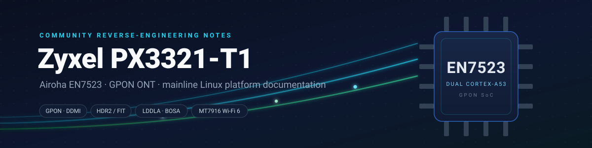
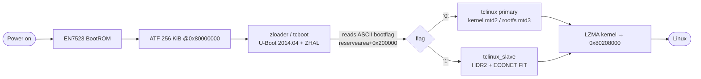

<div align="center">



# Zyxel PX3321-T1 · Airoha EN7523 Platform Notes

**Community documentation for running mainline Linux on an ISP-locked GPON ONT**

[](#document-map)
[](docs/hardware.md)
[](https://openwrt.org)
[](docs/optical-bob.md)
[](docs/wifi-calibration.md)
[](LICENSE.md)

*Everything we learned while bringing mainline OpenWrt to this board — the parts that
took the longest to figure out and that nobody had written down.*

[Document map](#document-map) ·
[TL;DR](#the-platform-at-a-glance) ·
[Boot chain](#the-boot-chain-at-a-glance) ·
[Key discoveries](#key-discoveries) ·
[Related work](#related-work)

</div>

---

## Document map

| Document | Contents |
|---|---|
| [`hardware.md`](docs/hardware.md) | SoC, RAM, flash silicon, reserved memory, optical front-end, Wi-Fi |
| [`uart.md`](docs/uart.md) | Locating & using the serial console (J1 header), discovery method |
| [`boot-chain.md`](docs/boot-chain.md) | zloader → HDR2/FIT dual-image boot, bootflag mechanics |
| [`flash-map.md`](docs/flash-map.md) | Full 256 MB NAND partition map — vendor **and** OpenWrt layouts |
| [`vendor-tools.md`](docs/vendor-tools.md) | `zycli`, `zyledctl`, `prolinecmd` — the hidden stock toolbox |
| [`optical-bob.md`](docs/optical-bob.md) | **The LDDLA BOB calibration table**: format, hiding place, how to enable DDMI on mainline |
| [`wifi-calibration.md`](docs/wifi-calibration.md) | MT7916 EEPROM conventions, the *"no precal"* case |
| [`gpon-next-steps.md`](docs/gpon-next-steps.md) | GPON/xPON bring-up: OMCI, provisioning identity, reaching O5 |
| [`bootloop-forensics.md`](docs/bootloop-forensics.md) | Autopsy of a real kernel-vs-kmods ABI mismatch |
| [`uboot-cli-and-env.md`](docs/uboot-cli-and-env.md) | **ECNT> CLI access recipe**, env block @ mtd0 tail (`0x70000`), autoboot RE, "full U-Boot without flashing" strategy |
| [`recovery.md`](docs/recovery.md) | Serial failsafe, ZHAL + ATENv3, getting out of a brick |

---

## The platform at a glance

| Component | Detail |
|---|---|
| **SoC** | Airoha **EN7523** — ARMv7, 2× Cortex-A53 @ 1 GHz (package `EN7529CT`) |
| **RAM** | 512 MiB DDR3-1866 (~456 MiB usable after ATF/NPU/QDMA reservations) |
| **Flash** | Micron SPI-NAND **256 MiB**, airoha-sni/SNFI controller |
| **Ethernet** | Airoha eth (10G internal) + **MT7530 DSA** switch, 4× GbE LAN |
| **Wi-Fi** | **MT7916** DBDC on PCIe — 2.4 GHz 2×2 + 5 GHz 3×3 (AX3000) |
| **Optical** | Integrated **EN7571 LDDLA/BOSA** GPON front-end on **i2c0 @ 0x70** |
| **Crypto** | Inside-Secure EIP93 |

> [!TIP]
> This is *not* a pluggable-SFP box: the GPON transceiver is a BOSA bonded to the PCB,
> driven by its own EN7571 chip. Getting DDMI working on mainline is one of the
> highlights of this repo → [`optical-bob.md`](docs/optical-bob.md).

## The boot chain at a glance



The bootloader also injects board data into the kernel command line — including
`ethaddr=`, `country_code`, GPIO maps and `root=/dev/mtdblock6`. Full breakdown in
[`boot-chain.md`](docs/boot-chain.md).

## Key discoveries

<details open>
<summary><b>The BOB laser calibration table — hidden in <code>reservearea+0x140000</code></b></summary>

<br/>

Not in the firmware image, not in romfile, not in rom-d, not in wwan. The ~225-byte
per-unit laser calibration (**Iav / Imod / Pav**) lives inside the proline factory
structure in the reservearea partition, with a PON magic at `+0x94`
(e.g. `0x07050701`: profile/chip bits). Feed it to the mainline driver as
`/lib/firmware/airoha/en7571_bob.bin` (400 bytes, FF-padded) and you get full DDMI:

```text
en7571 0-0070: EN7571 initialised: GPON, rev 2, KT1, DDMI1
```

**Caution:** It contains **your unit's** laser bias settings — publish the *format*, never your blob.
Complete field-by-field layout: [`optical-bob.md`](docs/optical-bob.md).

</details>

<details>
<summary><b>This SKU ships with NO WiFi precalibration data — and that's fine</b></summary>

<br/>

The 208 KB `RT30xxEEPROM.bin` in the stock firmware is a generic template; only the first
4 KiB carry real data. Mainline mt76's precal flag (`0x19A`) reads **zero in every source
we could check**: live flash, the untouched full-flash dump, and the vendor's own exported
blob. Known upstream case — see [OpenWrt PR #14412](https://github.com/openwrt/openwrt/pull/14412).
Do not expect precal-based boot-time savings here.
Details: [`wifi-calibration.md`](docs/wifi-calibration.md).

</details>

<details>
<summary><b>UART J1 pinout: GND · empty · TX · RX · VCC (115200 8N1, 3.3 V)</b></summary>

<br/>

An unpopulated 5-position factory header with one **empty slot** separating ground from
the signal group. Found by sweeping a single wire across candidate pins during a
continuous capture while power-cycling a looping board — no schematic needed.
Never feed 5 V into these pads; VCC can stay unconnected.
Method and host-side recipes: [`uart.md`](docs/uart.md).

</details>

<details>
<summary><b>Factory MAC randomization bug — zloader passes <code>ethaddr=</code>, mainline ignores it</b></summary>

<br/>

The bootloader injects the factory MAC as `ethaddr=` on the kernel command line, but
mainline drivers don't read it there — so Ethernet comes up with a **random MAC every
boot**. Fix it in userspace (`uci macaddr` on the LAN bridge or a runtime `ip link set`),
or wire up cmdline parsing in your port. Related identity data (GPON serial, registration
ID, PLOAM password) is readable via `prolinecmd` → [`vendor-tools.md`](docs/vendor-tools.md),
and matters for OLT authorization → [`gpon-next-steps.md`](docs/gpon-next-steps.md).

</details>

<details>
<summary><b>Dual-image bootflag: one ASCII byte at <code>reservearea+0x200000</code></b></summary>

<br/>

`'0'` boots the primary image, `'1'` boots the slave — verified live on the serial console:

```text
bootflag==1 --> booting from second image
## Loading kernel from FIT Image at 81800000 ...
   Verifying Hash Integrity ... OK
```

On stock, flip it with `/usr/bin/sys bootflag swap` and restart with `zycli reboot`
(the plain `reboot` binary may silently no-op). Beware ECC damage: a corrupt flag sector
makes the loader ignore every swap and always fall back to primary.
More: [`flash-map.md`](docs/flash-map.md), [`recovery.md`](docs/recovery.md).

</details>

<details>
<summary><b>HDR2/ECONET FIT container quirks (CRC32 without final XOR)</b></summary>

<br/>

Each kernel image is a 372-byte **HDR2** header followed by an ECONET-style FIT
(`kernel@1` lzma, `fdt@1`, `filesystem@1`). The CRC uses the ECONET variant:
poly `0xEDB88320`, init `0xFFFFFFFF`, **no final XOR** — standard zlib crc32 will not
match. The squashfs must sit at flash offsets aligned to the vendor table's `…858`
boundaries. Byte-level layout: [`boot-chain.md`](docs/boot-chain.md).

</details>

<details>
<summary><b>The stock toolbox is deeper than it looks</b></summary>

<br/>

`/bin/zycli` is a single multi-tool binary — `sys`, `wan`, `wlan`, `restoredefault`,
`vcautohuntctl` are all symlinks that change behavior by `argv[0]`, and it even embeds an
i2c bus reader. `zyledctl` drives 15 named panel LEDs through `/proc/tc3162/led_*`.
`prolinecmd` exposes the entire factory provisioning surface: `xponsn`, `xponpwd`,
`GponRegId`, `mt7570bob`, web credentials, SSID defaults…
Full inventory: [`vendor-tools.md`](docs/vendor-tools.md).

</details>

## Case study: a bootloop autopsy

One of the most useful pages here documents a real failure: after flashing, the kernel
booted fully, then panicked ~42 s in — two unrelated modules (`cfg80211`, `nf_tables`)
NULL-derefing at the same point while iterating netdevs. The deduction chain — same crash
site, different offsets ⇒ ABI mismatch, not logic bugs — plus the objdump proof and the
prevention rule (*config-touching commits ⇒ full rebuild*) are in
[`bootloop-forensics.md`](docs/bootloop-forensics.md).

<details>
<summary>The crash signature</summary>

```text
[   42.0] Unable to handle kernel NULL pointer dereference at virtual address 00000001
[   42.0] Modules linked in: cfg80211(O+)
[   42.0]   cfg80211_netdev_notifier_call ← register_netdevice_notifier
Kernel panic - not syncing: Fatal exception
Rebooting in 1 seconds..
```

With `CONFIG_MODVERSIONS=n`, vermagic still matches and nothing warns — struct fields
simply sit at shifted offsets.

</details>

## Where this is going: GPON internet on mainline

Drivers exist (`AIROHA_XPON`, optical front-end); the remaining milestone is the protocol
stack. After physical activation, the **OLT provisions the ONT over OMCI** (ITU-T G.988).
A community open-source OMCI daemon has reached **O5 state on live ISP fiber** for
EcoNet-family platforms and is considered portable to the ARM EN7523. Roadmap and
provisioning-identity notes: [`gpon-next-steps.md`](docs/gpon-next-steps.md).

> [!WARNING]
> Flashing ISP-locked hardware carries real risk of bricking. Read
> [`recovery.md`](docs/recovery.md) **before** your first write to NAND — and know all
> three exits (failsafe, ZHAL, dual-image flag) before you need them.

## Related work

| Project | Link |
|---|---|
| Airoha EN7523 OpenWrt base (Queiroga/Sirherobrine23) | [github.com/Sirherobrine23/airoha_en7523](https://github.com/Sirherobrine23) |
| OpenWrt upstream EcoNet target | [openwrt.org — EcoNet](https://openwrt.org/toh/hwdata/econet/econet) |
| EcoNet Linux community wiki | [econet-linux.pkt.wiki](https://econet-linux.pkt.wiki) |
| GPON reverse-engineering hub | [hack-gpon.org](https://hack-gpon.org) |
| OpenWrt PR: MT7621 EEPROM → NVMEM conversion ("no precal" case) | [PR #14412](https://github.com/openwrt/openwrt/pull/14412) |

## Contributing

Found something wrong? Have a sibling device (DX3301, EX3301-T0, EX5601-T0, PMG5617 —
they share the OPAL layout)? **Open an issue or a PR.** Diagrams are hand-written SVG;
PCB silkscreen photos of other variants are very welcome. When documenting per-unit
data (MACs, serials, calibration blobs), always publish formats — never values.

---

<div align="center">

**Docs CC BY 4.0 · Code snippets MIT** — see [`LICENSE.md`](LICENSE.md)

[Back to top](#zyxel-px3321-t1--airoha-en7523-platform-notes)

*Made with a CH340 adapter and far too many hours staring at boot logs.*

</div>
