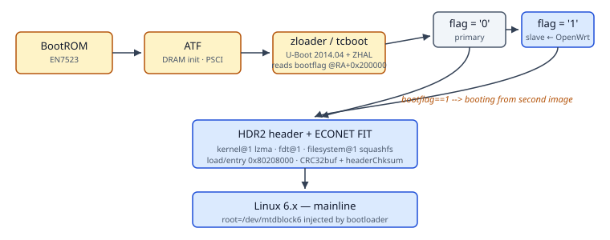

# Zyxel PX3321-T1 / Airoha EN7523 — Platform Notes & Reverse Engineering

> Community documentation for running mainline Linux on the **Zyxel PX3321-T1**,
> an ISP-locked GPON ONT built around the **Airoha EN7523** (ARM Cortex-A53 ×2)
> with an integrated **EN7571 LDDLA/BOSA** optical front-end and **MediaTek
> MT7916** Wi-Fi 6.

---

## What you will find here

Everything we learned while bringing **mainline OpenWrt** to this device —
the parts that took the longest to figure out and that nobody had written
down:

| Document | Contents |
|---|---|
| [`docs/hardware.md`](docs/hardware.md) | SoC, RAM, flash layout, optical front-end, Wi-Fi silicon |
| [`docs/uart.md`](docs/uart.md) | Locating and using the serial console (J1 header) |
| [`docs/boot-chain.md`](docs/boot-chain.md) | zloader → tcboot → HDR2/FIT dual-image boot, bootflag mechanics |
| [`docs/flash-map.md`](docs/flash-map.md) | Full 256 MB NAND partition map, both vendor and OpenWrt layouts |
| [`docs/vendor-tools.md`](docs/vendor-tools.md) | `zycli`, `zyledctl`, `prolinecmd` — the hidden stock toolbox |
| [`docs/optical-bob.md`](docs/optical-bob.md) | **The LDDLA BOB calibration table**: format, where it hides, how to enable DDMI on mainline |
| [`docs/wifi-calibration.md`](docs/wifi-calibration.md) | MT7916 EEPROM conventions, the "no precal" case |
| [`docs/gpon-next-steps.md`](docs/gpon-next-steps.md) | GPON/xPON bring-up: OMCI, provisioning identity, O5 state |
| [`docs/bootloop-forensics.md`](docs/bootloop-forensics.md) | A real kernel-vs-kmods ABI mismatch autopsy |
| [`docs/recovery.md`](docs/recovery.md) | Serial failsafe, ZHAL, getting out of a brick |

## TL;DR highlights

* The UART lives on header **J1** — 115200 8N1, 3.3 V. See [uart.md](docs/uart.md).
* The bootloader passes the factory MAC as `ethaddr=` on the kernel command
  line; mainline drivers ignore it unless you handle it in userspace.
* The optical module's factory calibration (**BOB table**, 225 bytes) is
  stored in the *reservearea* partition at offset `0x140000` — **not** inside
  the 4 KB EEPROM blob, and **not** shipped anywhere in firmware.
* Feeding that table to mainline mt76-family tooling as
  `/lib/firmware/airoha/en7571_bob.bin` brings up full **DDMI** monitoring:
  `EN7571 initialised: GPON, rev 2, KT1, DDMI1`.
* This hardware SKU ships with **no WiFi precalibration data** at all
  (flag `0x19A = 0x00`) — that is normal, see [wifi-calibration.md](docs/wifi-calibration.md).
* A community **open-source OMCI daemon** has reached O5 state on live ISP
  fiber for EcoNet/Airoha platforms — GPON internet without vendor blobs is possible.

## Related work

| Project | Link |
|---|---|
| Airoha EN7523 OpenWrt base (Queiroga/Sirherobrine23) | [github.com/Sirherobrine23/airoha_en7523](https://github.com/Sirherobrine23) |
| OpenWrt upstream EcoNet MIPS target | [openwrt.org — EcoNet](https://openwrt.org/toh/hwdata/econet/econet) |
| EcoNet Linux community wiki | [econet-linux.pkt.wiki](https://econet-linux.pkt.wiki) |
| hack-gpon.org — GPON reverse engineering | [hack-gpon.org](https://hack-gpon.org) |
| OpenWrt PR: ramips MT7621 EEPROM → NVMEM conversion | [PR #14412](https://github.com/openwrt/openwrt/pull/14412) |

## Contributing

Found something wrong? Have a sibling device (DX3301, EX3301-T0, EX5601-T0,
PMG5617 — they share the OPAL layout)? Open an issue or a PR. Diagrams are
Mermaid + hand-written SVG; screenshots of PCB silkscreen are very welcome.

## License

Documentation: CC BY 4.0. Code snippets: MIT.
