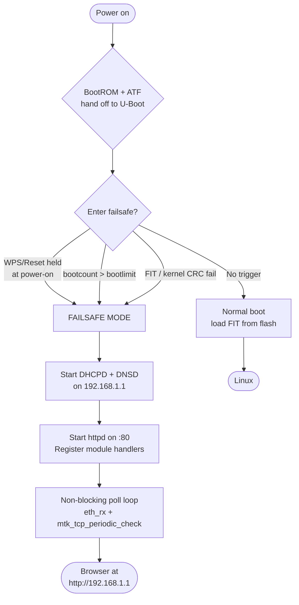

# 🌐 MT798x Failsafe Bootloader — What `bl-mt798x-dhcpd` Does and Why It Matters for EN7523

[← Back to README](../README.md)

> **TL;DR** — MediaTek MT798x boards can ship a U-Boot 2025 that *is* a recovery OS: DHCP + DNS + Telnet + a full Web UI running directly from the bootloader, with flash read/write, env editing, UBI management, and one-click backup — no OS on flash required. The PX3321-T1 (Airoha EN7523) does not have this today; equivalent recovery runs over UART via the proprietary `ECNT>` / `ZHAL>` shell (`ATRF`/`ATWF`/`ATDU`). The architecture and code patterns from `bl-mt798x-dhcpd` are portable to EN7523 mainline U-Boot once Ethernet is wired up — different SoC, same HTTP/DHCP/DNS stack. Hardware-validated 2026-08.

| Item | Detail |
|---|---|
| **Reference repo** | [`Yuzhii0718/bl-mt798x-dhcpd`](https://github.com/Yuzhii0718/bl-mt798x-dhcpd) — U-Boot 2025 for MT7981/MT7986/MT7987/MT7988 |
| **License** | GPL-2.0 |
| **Community signal** | ~280 stars · ~199 forks · <10 open issues — mature, field-tested across vendors |
| **PX3321-T1 connection** | Same author (`Yuzhii0718`) who published the `V544ACHK0C0_GPL` source for this board |

---

## 1. What MT798x boards have

A stock MT798x build from this tree replaces the vendor mini-bootloader with a self-contained recovery environment compiled *into* `u-boot.bin`:

| Built-in service | What it gives you at power-on |
|---|---|
| **DHCPD** | Serves `192.168.1.1/24` (range `192.168.1.100–200`) so a laptop gets an address with no external DHCP |
| **DNSD** | Answers all queries to itself — captive-portal style, so `http://192.168.1.1` always resolves |
| **Telnetd** | Bootloader shell over TCP (parallel to UART console) |
| **HTTPd + Web UI** | Multi-theme Bootstrap/GL/MTK interface at `http://192.168.1.1` |
| **Flash editor** | Read/write arbitrary NAND offsets from the browser |
| **Env manager** | List / add / delete / reset U-Boot variables (`printenv`/`setenv`/`saveenv` via web) |
| **Backup & download** | Dump any MTD/UBI partition to the browser in one click |
| **Web console** | U-Boot console piped to a browser terminal |
| **RF EEPROM update** | Push wireless calibration blobs without reflashing the whole image |
| **UBI manager** | Create / remove / resize UBI volumes |
| **I18n** | English, Chinese, and more (MT798x community default) |

The result: a bricked board with no valid `kernel`/`rootfs` is still reachable over Ethernet within seconds of power-on, from any browser — no serial adapter, no TFTP server on the host.

### Repository layout (what to read first)

```text
bl-mt798x-dhcpd/
├── atf-20250711/            # ARM Trusted Firmware (MT798x-specific)
├── uboot-mtk-20250711/      # U-Boot 2025 (+ patches)
│   ├── board/mediatek/      # Board ports + defconfigs
│   ├── drivers/net/         # MTK network drivers, mtk_tcp stack
│   ├── failsafe/            # ← The interesting part
│   │   ├── embedded/        # HTML/CSS/JS assets (minified at build)
│   │   ├── modules/         # upgrade / backup / flash / env / console / UBI
│   │   ├── failsafe_core.c  # Entry + HTTP routing
│   │   ├── fs.c             # In-memory filesystem (fsdata)
│   │   ├── Kconfig          # CONFIG_WEBUI_FAILSAFE_*
│   │   └── Makefile
│   └── configs/             # One defconfig per board
├── Kconfig / Makefile       # Top-level menu + build orchestration
└── build.sh                 # Multi-board CI build
```

---

## 2. How it works

### 2.1 Boot decision — when failsafe triggers



Typical entry conditions (configurable per board via `Kconfig` / `CONFIG_BOOTCOUNT_LIMIT`):

* Physical button sampled in early U-Boot (`gpio_get_value`).
* `bootcount` incremented in env on each attempt; `bootlimit` trips after N consecutive failures.
* FIT header / hash verification failure.

### 2.2 Network and HTTP stack

```mermaid
flowchart LR
    subgraph net["net/ — SoC-adjacent"]
        ETH[MTK Ethernet\n + switch/DSA]
        TCP[mtk_tcp\nTCP server + timer]
        DHCP[mtk_dhcpd]
        DNS[mtk_dnsd]
    end
    subgraph httpd["failsafe/ — SoC-agnostic"]
        CORE[failsafe_core.c\nhttpd_create_instance :80]
        MODS[modules/\nupgrade | backup | flash\nenv | console | UBI | misc]
        FS[fs.c / fsdata.c\nminified web assets]
    end
    ETH --- TCP
    TCP --- DHCP
    TCP --- DNS
    TCP --- CORE
    CORE --- MODS
    FS --- CORE
    MODS --> BROWSER([Browser\n192.168.1.1])
```

The split matters for porting: `net/mtk_tcp` and the Ethernet driver are MediaTek-specific; the `failsafe/` HTTP routing, module API, and web assets are not.

### 2.3 Module registration pattern

Each feature registers its own HTTP handlers on the shared instance — the pattern to copy to any SoC:

```c
// failsafe_core.c — simplified
struct httpd_instance *inst = httpd_create_instance(80);

misc_register_handlers(inst);
upgrade_register_handlers(inst);
backup_register_handlers(inst);
flash_register_handlers(inst);
env_register_handlers(inst);
console_register_handlers(inst);

while (!ctrlc() && !mtk_tcp_done_flag && !auto_action_pending) {
    eth_rx();
    mtk_tcp_periodic_check();
    schedule();   // U-Boot cooperative scheduler
}
```

Individual modules own their routes (`/flash`, `/env`, `/backup`, …) and call into the MTD/U-Boot APIs (`mtd_read`, `env_set`, `ubi_*`, …) directly — no Linux required.

### 2.4 Web assets baked into U-Boot

```text
npm install → terser + clean-css + html-minifier-terser
        ↓
    fsdata.c  (C array of minified HTML/CSS/JS, auto-generated)
        ↓
  compiled into u-boot.bin
```

Sizes in practice: minified UI lands at ~50–100 KiB; the entire addition fits comfortably in a 512 KiB `u-boot` partition after compression — but the vendor 15 KiB zloader on PX3321-T1 would need repartitioning if this path is pursued (see §6).

### 2.5 Build-time selection via Kconfig

```kconfig
# uboot-mtk-20250711/failsafe/Kconfig
config WEBUI_FAILSAFE
    bool "Web failsafe UI"

config WEBUI_FAILSAFE_ADVANCED
    bool "Advanced tabs (UBI, RF EEPROM)"

config MTK_DHCPD
    bool "Built-in DHCP server"

config MTK_DNSD
    bool "Built-in DNS server (captive portal)"
```

Portable idea even before a full U-Boot swap: the OpenWrt build already uses Kconfig — modularizing bootloader features the same way keeps optional weight out of the base image.

---

## 3. Why this matters for EN7523 / PX3321-T1

The EN7523 is an Airoha (formerly EcoNet) SoC, not MediaTek — TF-A, DRAM init, flash controller, and Ethernet drivers differ. But `bl-mt798x-dhcpd` is still the best reference we have for *what a modern bootloader recovery flow should look like* on a consumer fiber ONT, and the same GPL author knows both platforms.

| Re-use directly | SoC-specific (do not copy raw) |
|---|---|
| HTTP routing pattern + module API | `board/mediatek/` pin/port selection |
| DHCPD/DNSD captive-portal logic (concept) | `airoha_eth` / NPU driver (≠ `mtk_eth`) |
| Env/flash/UBI/backup browser workflows | SPI-NAND ↔ eMMC/NAND layout, MTD offsets |
| Kconfig modularization | ATF / BootROM / load addresses (`0x81800000` on PX3321-T1) |
| Asset embedding via `fsdata.c` | Switch/DSA config (MT7530 on PX3321-T1) |

Upstream U-Boot for EN7523 has been progressing independently (Mikhail Kshevetskiy's ~19-patch series: console, `airoha_eth`, SPI-NAND, GPT) and already carries pieces of the same `net/mtk_tcp` stack — the HTTP/DHCP layer is the portable half.

---

## 4. What we do today on PX3321-T1 (UART + ZHAL)

Current recovery on this board is entirely serial:

* **Prompt** — `ZHAL>` (often rendered `ECNT>` in sibling ZX SKUs), a 33-command proprietary shell on top of U-Boot 2014.04-rc1 + ZHAL extension; no standard `printenv`/`setenv`/`help` without unlocking.
* **Unlock** — `ATSE PX3321-T1` prints a 36-char hex seed; the ATENv3 password is `MD5(seed)` nibble-XOR folded to 8 chars (see [`recovery.md`](recovery.md) / [`bootloader-deep-dive.md`](bootloader-deep-dive.md) for the exact recipe and Python one-liner).
* **Raw flash I/O** — `ATRF addr,len,ram` / `ATWF addr,len,ram` / `ATDU` with an explicit RAM staging buffer (e.g. `0x80000000`). `ATGO` to jump to code in RAM. *(See deep-dive for the validated memory map and dump addresses.)*

```text
# Dump 16 KiB of zloader via UART (host-side capture)
# UART 115200 8N1, 3.3 V — see uart.md for J1 pinout

ZHAL> ATRF 0x50000,0x4000,0x80000000
ZHAL> ATDU 0x80000000,0x4000
# host: capture binary stream -> zloader.bin

# Swap boot image (stock image has two slots, selected by ASCII flag at reservearea+0x200000)
/usr/bin/sys bootflag swap    # on running Linux (stock)
zycli reboot                   # plain `reboot` may no-op on stock
```

No DHCP, no HTTP, no browser-accessible recovery — a USB-UART adapter is mandatory, and every flash read/write crosses a manual RAM staging step. The MT798x web flow above eliminates exactly that friction.

---

## 5. Side-by-side comparison

| Dimension | MT798x + `bl-mt798x-dhcpd` | PX3321-T1 today (EN7523 + ZHAL/zloader) |
|---|---|---|
| **SoC family** | MediaTek MT798x (ARM) | Airoha EN7523 (ARMv7 2×A53, EcoNet lineage) |
| **Bootloader** | U-Boot 2025 mainline + failsafe patches | `zloader` / `tcboot` — U-Boot 2014.04 + ZHAL |
| **Network in bootloader** | ✅ DHCPD + DNSD + HTTPD | ❌ None — UART only |
| **Browser recovery** | ✅ Full Web UI (flash/env/UBI/backup/console) | ❌ Web UI only after Linux has booted |
| **Flash R/W** | Browser → arbitrary MTD offset | `ATRF`/`ATWF` + `ATDU` over serial |
| **Env editing** | Browser (`/env`) + CLI | `ATGU` twice / hidden—no `printenv`/`setenv` |
| **Failsafe trigger** | Button / `bootcount>bootlimit` / CRC fail | `bootflag` ASCII at `reservearea+0x200000` |
| **Backup** | One-click download per partition | Raw UART dump → host capture |
| **Primary use case** | End-user self-recovery over Ethernet | Technician recovery with serial jig |

---

## 6. Porting feasibility to EN7523

### 6.1 What transfers, what needs work

| Layer | Verdict |
|---|---|
| `failsafe/` HTTP routing + modules + embedded assets | **Portable** — SoC-agnostic, talks to MTD/env/UBI APIs |
| `net/mtk_tcp` HTTP/TCP server | **Adaptable** — already partly present in upstream EN7523 U-Boot |
| `net/mtk_dhcpd` / `mtk_dnsd` | **Reimplement on top of EN7523 TCP stack** — logic is generic |
| `airoha_eth` + MT7530 DSA bring-up in U-Boot | **Required prerequisite** — Kshevetskiy series covers this; validate on this board |
| GPT / NAND layout, load addresses, ATF | **Board-specific** — cannot copy MT798x values; map from `boot-chain.md` / `flash-map.md` |
| Partition sizing for web payload | **Needs attention** — zloader is ~15 KiB; a minified UI is ~50–100 KiB. The `u-boot` MTD slot is 512 KiB; OpenWrt's slave-slot layout leaves room, but stock needs resizing |

### 6.2 Suggested path (no commitment to a timeline)

1. **Understand the current loader** — dump and analyze `zloader` at `0x50000` (procedure in [`bootloader-deep-dive.md`](bootloader-deep-dive.md)). Never write the bootloader from UART without a verified dump + recovery jig on hand.
2. **Bring up EN7523 mainline U-Boot in RAM** — chain-load a FIT image via `ATGO` from the running ZHAL, without overwriting flash (documented approach in the deep-dive). Confirm console, `airoha_eth`, SPI-NAND, and GPT.
3. **Port `failsafe/` modules incrementally** — order by value/effort:

   | Feature | Priority | Effort on EN7523 |
   |---|---|---|
   | DHCPD | High | Medium (needs working `eth_rx` first) |
   | Basic Web UI (upgrade + backup) | High | High (HTTP server bring-up) |
   | Env manager | Medium | Low (U-Boot already has env API) |
   | Flash editor | Medium | Medium (MTD abstraction) |
   | Web console | Low | Medium (console hook) |
   | DNSD / UBI mgmt / RF-EEPROM | Low | Low once HTTP works |

4. **Wire `bootcount`/`bootlimit` failsafe** — replace the single-byte `bootflag` with U-Boot's native `bootcount` + `bootlimit` for automatic rollback, matching the MT798x flow.
5. **Only then consider overwriting `zloader`** — treat the stock loader as immutable until every step above is stable from RAM boot.

> [!CAUTION]
> Writing the bootloader partition can brick the board beyond software recovery. Keep the slave image slot (`tclinux_slave` / `reservearea+0x200000` flag) intact, verify every flash write with a readback, and read [`recovery.md`](recovery.md) before the first write to NAND.

### 6.3 When not to do this

If the goal is simply running OpenWrt, `zloader` patched via `carlicious/zloader` or the existing `tclinux_slave` slave-slot workflow is sufficient — a full `bl-mt798x-dhcpd`-style port pays off only if browser-based field recovery (no serial jig) justifies the effort.

---

## 7. References

| Resource | URL |
|---|---|
| `bl-mt798x-dhcpd` (reference implementation) | `github.com/Yuzhii0718/bl-mt798x-dhcpd` |
| U-Boot EN7523 upstream (Kshevetskiy series) | `lists.denx.de/u-boot/2025-November/602123.html` |
| This repo — bootloader deep dive | [`bootloader-deep-dive.md`](bootloader-deep-dive.md) |
| This repo — recovery toolbox | [`recovery.md`](recovery.md) |
| This repo — boot chain (HDR2/FIT, bootflag) | [`boot-chain.md`](boot-chain.md) · [`flash-map.md`](flash-map.md) |
| This repo — UART / hardware | [`uart.md`](uart.md) · [`hardware.md`](hardware.md) |
| `carlicious/zloader` (patched zloader) | `github.com/carlicious/zloader` |
| OpenWrt EN7523 carry set | `github.com/openwrt/openwrt` PR `#20104` |
| Broad reference (EcoNet Linux) | `econet-linux.pkt.wiki` · `hack-gpon.org` |

---

*Compiled from UART captures, GPL source analysis, `bl-mt798x-dhcpd` source review, and community patches. PX3321-T1 UART flow hardware-validated 2026-08; MT798x behavior from source and community reports — typos and deltas welcome via PR.*

[← Back to README](../README.md)
