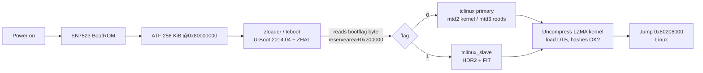

# Boot Chain



## Stages

1. **BootROM → ATF**: ARM Trusted Firmware initializes DRAM
   (`EN7523DRAMC V0.6`, DDR3-1866, 512 MB) and exposes PSCI v1.1.
2. **zloader / tcboot**: U-Boot 2014.04 fork with the Zyxel **ZHAL**
   extension. Reads the dual-image bootflag from reservearea and loads the
   matching `tclinux` container: a 372-byte **HDR2** header followed by an
   ECONET-style FIT (kernel@1 lzma, fdt@1, filesystem@1).
3. **Kernel command line injection**: the bootloader appends board data to
   the cmdline — including `ethaddr=`, `country_code`, GPIO assignments and
   `root=/dev/mtdblock6` pointing at the slave rootfs.
4. **Kernel** decompresses at `0x80208000` (entry == load address; using the
   stock `0x80088000` hangs silently in head.S).

## HDR2 header layout

| Offset | Size | Field |
|---|---|---|
| 0x000 | 4 | magic `"HDR2"` |
| 0x008 | 4 | total size |
| 0x00C | 4 | crc32buf(FIT) — ECONET CRC32: poly `0xEDB88320`, init `0xFFFFFFFF`, no final XOR |
| 0x170 | 4 | headerChksum = crc32buf(header with field zeroed) |

The FIT itself follows at offset `0x174` with images `kernel@1`, `fdt@1`,
`filesystem@1`. The squashfs must be aligned so that its flash offset ends
in `0x858`-style boundaries inherited from the vendor partition table.

## Bootflag

One ASCII byte at **reservearea + 0x200000**: `'0'` boots primary,
`'1'` boots slave. On stock:

```sh
/usr/bin/sys bootflag read     # current value
/usr/bin/sys bootflag swap     # flip it (writes via mtd writeflash)
zycli reboot                   # native restart; plain reboot may no-op
```

If the flag sector has ECC damage, tcboot treats every value as invalid and
always falls back to primary — erase/repair the sector before swapping again.
