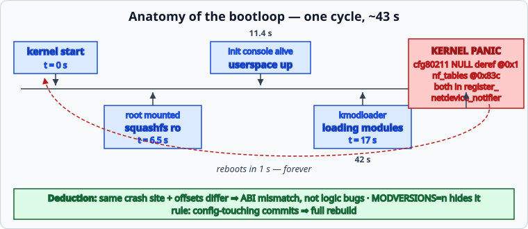

# 🔬 Bootloop Forensics — A Case Study

[← Back to README](../README.md) · [Recovery toolbox →](recovery.md)

After flashing a new image, the device entered a boot loop: full kernel
boot, userspace starting, then a panic ~42 s in, forever. This page documents
the diagnosis method — the pattern is more useful than the specifics.



## Symptom

```text
[    6.49] VFS: Mounted root (squashfs filesystem) readonly on device 31:6
[   11.4] init: Console is alive
[   17.0] kmodloader: loading kernel modules from /etc/modules.d/*
[   42.0] Unable to handle kernel NULL pointer dereference at virtual address 00000001
[   42.0] Modules linked in: cfg80211(O+)
[   42.0] Call trace:
[   42.0]   cfg80211_netdev_notifier_call ← register_netdevice_notifier
Kernel panic - not syncing: Fatal exception
Rebooting in 1 seconds..
```

After removing the wifi modules from the equation, a **second** module
panicked identically at the same timestamp:

```text
nf_tables_netdev_event+0x40 [nf_tables]
NULL pointer at virtual address 0000083c
```

## The deduction

Two unrelated modules (cfg80211, nf_tables) crashing **at the same point of
boot** with NULL derefs while iterating existing network devices means:

> *every* module registering a `net_device` notifier dereferences garbage —
> the problem is not in either module but in the kernel/module interface.

That rules out "bad wifi driver" and points to an **ABI mismatch between the
kernel and its loadable modules**: struct layouts compiled with different
configurations.

## Root cause

The image had been built incrementally after a commit that changed the
kernel config: the **kernel was recompiled**, the **kmods were not**.
With `CONFIG_MODVERSIONS=n`, vermagic still matches (`6.18.41`) and nothing
warns — fields simply sit at shifted offsets.

Proof by disassembly: in the shipped `nf_tables.ko`,
`net_generic()` reads `net->gen` at one offset; in the freshly-built
`vmlinux` that field sits 8 bytes elsewhere. Every notifier callback that
walks per-net data dereferenced the wrong address.

## Fix and prevention

* **Fix**: wipe `build_dir/` (kernel + rootfs + tmp) and rebuild everything
  in a single generation.
* **Prevention rule**: any commit touching `target/*/config-*` requires a
  full rebuild before packaging images for flashing.
* Consider enabling `CONFIG_MODVERSIONS=y` on development branches so
  mismatches are refused at load time instead of panicking at runtime.

## Tools that helped

| Tool | Use |
|---|---|
| Serial console | the only witness — no UART, no diagnosis |
| `dmesg` timestamps | identical crash offset across boots ⇒ systematic, not random |
| `objdump -d module.ko --disassemble=symbol` | read the exact instruction and offset |
| Kernel `Code:` line + register dump | reconstruct which pointer was NULL |
| Two-crash comparison | same site + different offsets = ABI class, not logic bug |

---

[← Back to README](../README.md) · [Recovery toolbox →](recovery.md)
