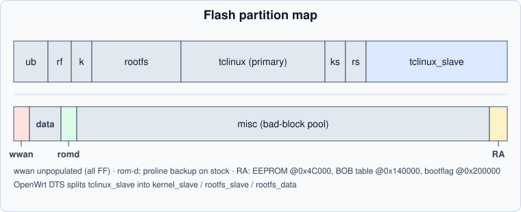

# Flash Map

256 MiB SPI-NAND (Micron), read through the airoha SNFI controller.



## Vendor (stock) layout — 13 partitions

| MTD | Size | Name | Notes |
|---|---|---|---|
| 0 | 0x080000 | bootloader | U-Boot 2014.04 + ZHAL, factory env at the end |
| 1 | 0x040000 | romfile | factory config container |
| 2 | ~2.5 MB | kernel | primary kernel (HDR2-wrapped) |
| 3 | ~26 MB | rootfs | primary squashfs |
| 4 | 48 MiB | tclinux | primary full container |
| 5 | ~4 MB | kernel_slave | secondary kernel |
| 6 | ~4.3 MB | rootfs_slave | secondary squashfs |
| 7 | 48 MiB | tclinux_slave | secondary full container (dual-image target) |
| 8 | **1 MiB** | wwan | `wwanpkg` — present but **never populated on this SKU** |
| 9 | 4 MiB | data | vendor storage (opaque blocks) |
| 10 | 1 MiB | rom-d | rom-d backup — **vendor writes to it at boot** (was empty in 2024 dumps) |
| 11 | 118 MiB | misc | bad-block pool / scratch |
| 12 | 2.25 MiB | reservearea | see breakdown below |

## reservearea internal layout

```text
0x04C000 .. 0x04D000   MT7916 EEPROM blob (4 KiB) + per-unit patch (~70 bytes)
0x140000               proline / BOB table region
                       (mt7570bob[225] laser calibration, magic @ +0x94)
0x200000               dual-image bootflag (ASCII '0'/'1')
```

Everything else reads as erased (`FF`).

!!! note
    The EEPROM blob is the **only** radio calibration stored here: power
    tables and per-unit IDs live in the first kilobyte; there is **no WiFi
    precal data** anywhere on this SKU (flag `0x19A = 0x00`).

## OpenWrt/mainline layout — 14 partitions

The mainline DTS splits the containers so that the driver can find the
rootfs directly:

| MTD | Name | Notes |
|---|---|---|
| 6 | rootfs_slave | `0x34c0858` — what the bootloader injects as `root=` |
| 7 | rootfs_data | jffs2 overlay, survives re-flashing of tclinux_slave |
| ... | same names otherwise | `kernel_slave`, `tclinux_slave`, `wwan`, `data`, `rom-d`, `misc`, `reservearea` |

Always address partitions **by name**, never by number: the stock and
OpenWrt maps shift every index after mtd2.
