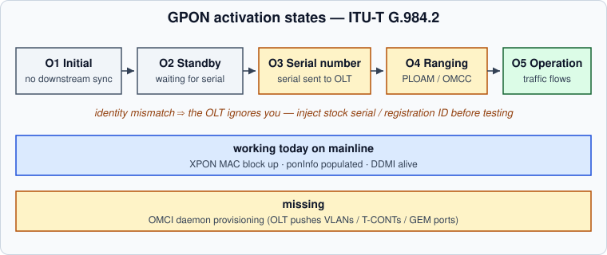
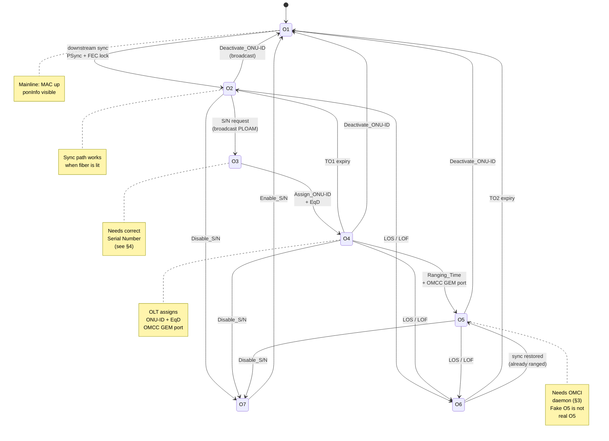
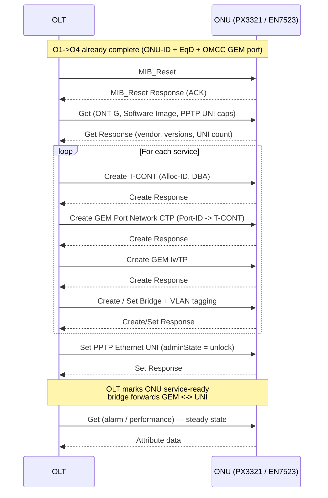

# 🌐 GPON on Mainline — From Optics to O5

[← Back to README](../README.md) · [Optical front-end →](optical-bob.md) · [Hardware overview →](hardware.md)

> Bringing fiber to `O5 Operation` on mainline is the last big milestone.
> The optics and the XPON MAC already run. What remains is the activation
> handshake across the fiber and the OMCI provisioning that makes O5 carry
> real traffic.



---

## 1  Current state on mainline

### 1.1  What ships today

| Block | Mainline status | Notes |
|---|---|---|
| **EN7571 LDDLA / BOSA** (i2c0 @ `0x70`) | DDMI alive once the BOB table is loaded | 400-byte `en7571_bob.bin` from `reservearea+0x140000`; see [optical-bob.md](optical-bob.md) |
| **AIROHA_XPON — PON MAC** | probed, `ponInfo` populated | GPON mode; GTC/GEM counters tick |
| **Activation FSM (O1->O5)** | O1/O2 reachable; O3+ requires OLT + identity | Without correct Serial / Registration ID the OLT ignores the ONU |
| **OMCI stack** | not yet — the gap this page describes | OLT pushes service profile only over OMCI |

Enable the two kernel pieces:

```kconfig
CONFIG_AIROHA_XPON=y          # PON MAC — GTC, GEM, PLOAM, ponInfo
CONFIG_AIROHA_OPTICAL=y       # EN7571 front-end + optical_frontend class + hwmon/DDMI
```

Device-tree wiring (EN7523 DTS):

```dts
&xpon {
        status = "okay";
        /* optional: default GPON identity as nvmem reference */
        gpon-serial-number = <&gponsn>;
};

&i2c0 {
        en7571: lddla@70 {
                compatible = "airoha,en7571";
                reg = <0x70>;
        };
};
```

### 1.2  What `/proc/xpon/ponInfo` exposes

On Airoha/EcoNet ports the PON MAC exports a proc node that is the single
best live indicator. Field names vary slightly across kernel revisions;
the semantics below match what the vendor SDK and the mainline driver print.

```sh
cat /proc/xpon/ponInfo
# --- example shape (placeholders, not a real dump) ---
# ponMode: GPON
# ponState: O2
# onuId: 0xFF          # 0xFF == unassigned
# gemPortNum: 0
# gtcDownstreamFrames: 1234567
# gtcUpstreamFrames:   0
# fecCorrected: 0
# losStatus: 0
# ploamReceived: 42
# omccPortId: 0xFFFF   # unassigned until O4
```

| Field | Meaning |
|---|---|
| `ponMode` | `GPON` / `EPON` / `XG-PON` selected by driver/firmware |
| `ponState` | Activation state `O1`..`O7` (ITU-T G.984.3 s10) |
| `onuId` | ONU-ID assigned by OLT in O3 (`0xFF` before assignment) |
| `omccPortId` | Dedicated GEM port for the OMCI channel — valid only from O4 |
| `losStatus` / `lofStatus` | Loss-of-signal / loss-of-frame — `1` means the optics see no light |
| `gtc*Frames`, `gem*` | GTC/GEM counters — prove downstream sync is truly arriving |
| `ploam*` | PLOAM message counters — confirm the OLT is talking to you |

Quick triage on live fiber:

```sh
# 1 — optics alive?
cat /sys/bus/i2c/devices/0-0070/optical_frontend/frontend0/{model,ready,tx_enabled}
cat /sys/class/hwmon/hwmon*/in*_input 2>/dev/null  # bias current / temperature

# 2 — MAC sees downstream?
cat /proc/xpon/ponInfo
dmesg | grep -iE 'xpon|pon|gpon|en7571|ploam'
```

If `losStatus=1` the problem is optical (fiber unplugged, wrong wavelength,
dirty connector). If `losStatus=0` but `ponState` never leaves `O1`, the
PON MAC is not locking to the downstream — check PON mode and that the
laser is not held in `tx-disable`.

---

## 2  The GPON activation machine — O1 -> O5

Reference: **ITU-T G.984.3 s10** (Transmission Convergence layer) for the
seven states `O1`–`O7`; G.984.2 for the optical layer. Hack-GPON's
[`gpon-auth`](https://hack-gpon.org/gpon-auth) gives a concise vendor-grounded
summary. The language below follows the standard.

### 2.1  State overview

| State | Name | Who drives the transition | Transmitter | What must be true |
|---|---|---|---|---|
| **O1** | Initial | ONU internally | **off** | Power-on reset; all prior ONU-ID, EqD, burst profiles cleared |
| **O2** | Standby | OLT -> ONU (Upstream_Overhead + Extended_Burst) | off | Downstream sync acquired; ONU learns delimiter, power level, pre-equalization delay |
| **O3** | Serial_Number | OLT polls -> ONU responds | **on only in assigned window** | OLT broadcasts S/N request; ONU sends Serial_Number PLOAM |
| **O4** | Ranging | OLT -> ONU | on in ranged window | OLT assigns ONU-ID (`Assign_ONU-ID`), then `Ranging_Time` + `Equalization_Delay` |
| **O5** | Operation | OLT <-> ONU (steady state) | on per BWmap | Normal data path; OMCI over dedicated GEM port provisions services |
| **O6** | Intermittent LODS | loss of downstream | off | Loss-of-signal; TO2 expiry -> O1, or sync restore -> O5 |
| **O7** | Emergency Stop | OLT `Disable_Serial_Number` | off | OLT silenced this ONU; only `Enable_S/N` -> O1 |

TO1 — serial-number / ranging guard timer; TO2 — LODS recovery timer.

### 2.2  State diagram (where mainline stalls today)



Dashed in plain English: **O1->O2 is local** (lock to the downstream).
**O2->O3->O4->O5 requires the OLT to cooperate**, and the OLT cooperates only
when the ONU presents a recognized identity.

### 2.3  Each state in detail

#### O1 — Initial

The ONU powers on with its transmitter **disabled**. All prior assignments
(ONU-ID, equalization delay, burst profiles) are erased. A hunt sub-state
searches for the downstream PSync field; until lock is achieved the ONU
asserts Loss-of-Signal / Loss-of-Frame. On first valid downstream frame the
ONU enters `O1.1 Off-Sync -> O1.2 Sync` internally and, once stable, moves to
O2. Any `Deactivate_ONU-ID` or `Disable_Serial_Number` addressed to this ONU,
or an emergency-stop condition, also returns here.

*Mainline today:* O1 is fully functional — `ponInfo` reads `O1` with no fiber
and leaves it as soon as downstream appears.

#### O2 — Standby

Downstream is now synchronous. The ONU extracts the `Upstream_Overhead` and
`Extended_Burst_Length` PLOAMs — delimiter, preamble, guard bits, pre-assigned
equalization delay — and applies them so that a future upstream burst will not
collide. The transmitter remains off. The ONU waits for a serial-number grant.

*Mainline today:* O2 works; if `ponInfo` shows `O2` with a lit fiber the
optical path and GTC framing are correct.

#### O3 — Serial_Number

The OLT periodically broadcasts a serial-number request in a quiet window.
Every un-ranged ONU that sees it transmits a `Serial_Number_ONU` PLOAM
containing its **vendor ID + serial number** (see §4). Collisions are
resolved by the OLT's ranging algorithm (binary search / random delay).
On success the OLT assigns a temporary **ONU-ID** via `Assign_ONU-ID` PLOAM
and an initial equalization delay. The ONU stores the ONU-ID and advances to
O4. If the OLT never assigns an ID, the ONU remains in O2/O3.

*Mainline today:* reaching O3 proves the upstream burst reached the OLT.
Staying in O2/O3 with valid optics almost always means a **provisioning
identity mismatch** — the OLT does not recognize the serial and never
assigns an ONU-ID.

#### O4 — Ranging

The OLT now measures round-trip time. It sends a directed ranging request
(BWmap entry with this ONU-ID and `PLOAMu=1`); the ONU replies; the OLT
computes the precise **Equalization Delay (EqD)** that aligns this ONU's
upstream bursts with the TDMA schedule and returns it in a `Ranging_Time`
PLOAM. At the same time the OLT allocates the **OMCC GEM port ID** — the
dedicated GEM channel that will carry OMCI. When the ONU applies the EqD,
ranging is complete.

*Mainline today:* O4 is where `omccPortId` in `ponInfo` should change from
`0xFFFF` to a real GEM port number. Timer **TO1** guards this state — expiry
drops back to O2.

#### O5 — Operation (and the fake-O5 trap)

Steady state: downstream frames are processed continuously; upstream bursts
are sent strictly per the OLT's BWmap. Two sub-states exist — `O5.1
Associated` (normal) and `O5.2 Pending` (processing a channel-tuning PLOAM on
TWDM systems). From the PON layer's perspective, O5 means *the link is up*.

**But O5 alone does not mean internet.** User traffic flows only after the
OLT provisions the service stack over **OMCI** (s4): T-CONTs, GEM ports,
VLANs, and the bridge to the UNI (Ethernet ports). Until that exchange
succeeds, O5 carries nothing but PLOAM and OMCI.

> **Fake O5 (notably on Alcatel/Nokia OLTs):** the OLT may report the ONU as
> `O5` while *withholding* the GEM bridge until the ONU answers OMCI correctly.
> Symptoms: `ponState: O5` + `omccPortId` valid, yet no GEM data ports, no
> DHCP, no PPPoE. Some OLTs also hold the ONU at this stage to push a
> firmware update. Changing the advertised software version in the OMCI
> `Software Image` ME can unblock it. See
> [hack-gpon `fakeO5`](https://github.com/Anime4000/RTL960x/blob/main/Docs/fakeO5.md)
> and [hack-gpon `gpon-auth`](https://hack-gpon.org/gpon-auth).

*Mainline today:* without an OMCI daemon the ONU can in principle reach
`O5` at the PLOAM layer yet never receive the service provisioning that makes
O5 useful. This is the missing piece.

#### O6 / O7 — Off-ramps

*O6 Intermittent LODS* — downstream lost after ranging. TO2 expiry -> O1;
sync restored quickly -> back to O5 (EqD still valid). *O7 Emergency Stop* —
the OLT administratively silenced this ONU (`Disable_Serial_Number`);
only `Enable_Serial_Number` returns to O1. Neither is a normal operating
state; both indicate a fiber or administrative condition.

---

## 3  OMCI — the piece that turns O5 into internet

### 3.1  Where OMCI sits

```
 ┌─────┐  1490 nm downstream / 1310 nm upstream   ┌─────┐
 │ OLT │ ────────────── fiber ─────────────────── │ ONU │── UNI (br0 / eth0)
 └──┬──┘    GTC frames: BWmap + PLOAM + GEM       └──┬──┘
    │  OMCI = G.988 master/slave over OMCC           │
    │  OMCC = one dedicated GEM port (from O4)       │
    └────────────────────────────────────────────────┘
                OLT is master — ONU never initiates
```

* **PLOAM** — physical-layer OAM (ONU-ID, EqD, keys). Handled by the PON MAC.
* **OMCI (G.988)** — service-layer provisioning. Runs **over GEM**, in its
  own OMCC port, as a reliable master/slave request/response protocol.
* **GEM** — the encapsulation that also carries user data. Each service flow
  gets its own GEM Port-ID.

OMCI was introduced as G.984.4 and is now the standalone **ITU-T G.988**
(technology-independent: GPON, XG-PON, XGS-PON, NG-PON2).

### 3.2  The Managed Entity model

The ONU exposes its capabilities as a MIB of **Managed Entities (MEs)**.
Each ME class has attributes and actions (Create/Delete/Set/Get). The OLT
walks/creates this tree to configure the bridge.

| ME (class) | Role | Typical attributes |
|---|---|---|
| **ONT-G** | Root — the ONU itself | Vendor ID, version, operational state |
| **ONT2-G** | Extended ONU caps | Connectivity, power, temperature |
| **T-CONT** | Upstream scheduler container | Alloc-ID, DBA policy, priority |
| **GEM Port Network CTP** | GEM termination | Port-ID, direction, T-CONT pointer, encryption |
| **GEM Interworking TP** | GEM <-> bridge interworking | Interworking option, GAL encapsulation |
| **MAC Bridge Service Profile** | 802.1D bridge instance | Spanning tree, learning, filtering |
| **MAC Bridge Port Config Data** | Bridge port binding | Bridge ID <-> TP pointer, VLAN handling |
| **VLAN Tagging Filter / Extended VLAN Tagging Operation** | VLAN push/pop/filter | Filter table, treatment (add/strip/translate) |
| **PPTP Ethernet UNI** | Physical Ethernet port | Admin state, speed, duplex, loopback |
| **VEIP** | Virtual Ethernet Interface Point | Used when the data path is presented as a virtual UNI |
| **Priority Queue / Traffic Scheduler** | QoS | Queue size, scheduling discipline, weights |
| **Software Image** | Firmware slots | Version strings, commit/activate |

A minimal residential service (one internet bridge on one UNI) typically
requires: `T-CONT` -> `GEM Port CTP` -> `GEM IwTP` -> `Bridge` ->
`Bridge Port` -> `VLAN tagging` -> `PPTP Ethernet UNI`. Multi-service (IPTV,
VoIP, TR-069) repeats this chain with distinct GEM ports and VLANs.

### 3.3  What the OLT actually pushes

In order, on a fresh ONU that just reached O5:

1. **MIB reset + upload** — `MIB_Reset`, `Get` / `Get_Next` sweep so the OLT
   learns the ONU's ME set and software versions.
2. **T-CONT + DBA** — at least one T-CONT bound to the ONU's Alloc-IDs;
   DBA profile (type 1–5, assured vs. non-assured bandwidth).
3. **GEM ports + interworking** — one or more `GEM Port Network CTP` +
   `GEM IwTP` pairs, each wired to a T-CONT.
4. **Bridge and VLANs** — `MAC Bridge Service Profile`, `Bridge Port Config`,
   `VLAN Tagging Filter` / `Extended VLAN Tagging Operation` that map each
   GEM flow to the right UNI and 802.1Q tag (e.g. internet `VID 10`, IPTV
   `VID 20`).
5. **UNI binding** — `PPTP Ethernet UNI` or `VEIP` admin-up, auto-negotiation,
   sometimes `Physical Path Termination Point` for POTS.
6. **QoS / queues** — `Priority Queue` + `Traffic Scheduler` hierarchy.
7. **Commit** — OLT considers the ONU *service-ready*; the bridge starts
   forwarding. On many networks PPPoE/DHCP then runs over the provisioned VLAN.

Without steps 2–5, O5 forwards nothing to the Ethernet switch — which is why
a `ponState: O5` with zero GEM data ports behaves like "link up, no traffic."

### 3.4  OMCI exchange — sequence



Baseline OMCI messages are 48 bytes (4-byte header + 40-byte content +
4-byte MIC); extended format (G.988 Amd.1) carries larger payloads.
Integrity uses a CRC-32 MIC; encryption of GEM payloads (AES-128) is
negotiated via PLOAM key exchange before OMCI starts flowing.

### 3.5  Open-source OMCI daemons

No daemon ships with the Airoha SDK — stock firmware bundles a closed
`omci` binary tied to the vendor PON stack. The community has filled the gap
with portable user-space daemons that speak OMCI over the kernel's OMCC GEM
device:

| Project | Language | Origin | Notes |
|---|---|---|---|
| **prpl `omcid`** (prpl Foundation / prplOS) | C | prpl open-source PON stack | Most complete G.988 model; used as reference for EcoNet ports |
| **hack-gpon `omcid` / `omci`** (community forks, thienanh95 / AKoo7 lineage) | C | EcoNet MIPS mainline bring-up | Reached **O5 on live ISP fiber** with hardware offload (PPPoE/NAT at near-gigabit); originally for EN7512/EN7521/EN7526-class MIPS, considered portable to ARM EN7523 |
| **OpenWrt `omci-app`** (package feed) | C | Wraps the above for OpenWrt packaging | Appears in recent `airoha/en7523` PRs as `omci` package scaffolding |

What "portable to EN7523" means concretely:

* The **protocol** is transport-agnostic — OMCI is bytes over a GEM port.
  The kernel side is a character device / netdev representing the OMCC.
* What changes per SoC is the **kernel UAPI glue**: how the daemon opens the
  OMCC channel, injects/receives OMCI frames, and programs the GEM/T-CONT
  datapath. On Airoha this is the `AIROHA_XPON` driver's OMCC interface;
  on EcoNet MIPS it is the `econet-pon` equivalent.
* The **ME model** (which MEs to implement, which attributes the local OLT
  actually exercises) is ISP-specific — porting always ends with captures on
  the target OLT.

Current expectation for the PX3321-T1: once the PON MAC exposes a stable
OMCC GEM channel, an `omcid` built against the Airoha UAPI should be able to
complete the exchange above with only board-specific identity and bridge
wiring changes. The EcoNet community wiki tracks kernel-side PON progress at
[econet-linux.pkt.wiki](https://econet-linux.pkt.wiki) and the associated
[open patches](https://github.com/openwrt/openwrt/pull/20104).

---

## 4  Provisioning identity — formats only

The OLT authenticates the ONU by serial number and, depending on the OLT
vendor/profile, by **Registration ID** (LOID) and/or **PLOAM password**.
On the PX3321-T1 stock firmware these live in the factory `reservearea`
and are surfaced by `prolinecmd`.

> [!CAUTION]
> This section documents **formats and access methods only**. Never publish
> your real serial, password, or Registration ID — they are per-unit secrets
> and, on many ISPs, the sole authorization factor. Use placeholders such as
> `<your-ont-sn>` in all logs and screenshots.

### 4.1  Fields and formats

| Concept | Stock accessor | Format (placeholder) | Notes |
|---|---|---|---|
| **GPON Serial Number** | `prolinecmd xponsn get` / `GponSerialNumber` in bootloader env | `SSSSNNNNNNNN` — 4-char vendor ID + 8 hex digits<br/>e.g. `<VENDOR><hex8>` like `HWTC1234ABCD` | ITU-T G.984.3: 4-byte Vendor ID (ASCII) + 4-byte serial (often printed on the label as 16 hex chars or vendor prefix + hex) |
| **PLOAM / OMCI password** | `prolinecmd xponpwd get` | 10-char printable ASCII (often hex-like)<br/>e.g. `<ploam-pwd>` | Sent in `Password` PLOAM during O4/O5; some OLTs ignore it, some require it |
| **Registration ID (LOID)** | `prolinecmd GponRegId get` | ISP-assigned string, often numeric or `user@isp`<br/>e.g. `<reg-id>` | Logical ONU ID — many ISPs bind the service to this, not just the serial |

Raw extraction without verbs (when `prolinecmd get` is absent on a given
firmware cut):

```sh
# reservearea is an MTD partition — dump and carve (offsets are per-image;
# verify against flash-map.md / vendor DTS for this unit)
nanddump -a /dev/mtd$(grep reservearea /proc/mtd | cut -d: -f1 | tr -d mtd) \
  | hexdump -C | grep -i gpon

# bootloader env (stock boot)
cat /proc/cmdline | tr ' ' '\n' | grep -i gpon
fw_printenv GponSerialNumber 2>/dev/null
```

On mainline, inject the identity through the PON driver's configuration
(UCI / runtime file / nvmem cell, depending on the kernel revision):

```sh
# illustrative — exact key names track the driver/dt binding in use
uci set xpon.@onu[0].serial='<your-ont-sn>'
uci set xpon.@onu[0].password='<ploam-pwd>'
uci set xpon.@onu[0].reg_id='<reg-id>'
uci commit xpon
/etc/init.d/xpon restart

# or verify what the driver actually picked up
cat /proc/xpon/ponInfo
dmesg | grep -iE 'serial|onu.id|regid|ploam'
```

A mismatched identity produces a very specific symptom: downstream sync is
fine (`O2` with `losStatus=0` and rising GTC counters) yet the OLT never
advances you past `O2/O3`. The OLT is simply ignoring an unrecognized ONU.

---

## 5  Roadmap — honest milestones with verifiable done criteria

Check a box only with evidence in hand (redacted `ponInfo` dumps,
screenshots, `dmesg`, captures). Drop artifacts into `docs/images/` with
serial/RegID scrubbed.

| # | Milestone | Done when… | Risk / why it stalls |
|---|---|---|---|
| M1 | **Optics alive — DDMI** | `en7571 0-0070: EN7571 initialised: GPON … DDMI1` in `dmesg`; `cat /sys/bus/i2c/devices/0-0070/optical_frontend/frontend0/ready` -> `1`; `hwmon` bias/temperature read sensible | BOB table missing or wrong — per-unit laser calibration; copying another unit's blob mis-biases the laser |
| M2 | **PON MAC up — `ponInfo` populated** | `cat /proc/xpon/ponInfo` shows `ponMode: GPON` and non-zero GTC counters on a lit fiber; no `losStatus=1` with fiber plugged | PON mode mismatch (GPON vs EPON/XG-PON); QDMA / clock / reset not wired in DTS |
| M3 | **Downstream sync — O1 -> O2** | On live fiber: `ponState: O2`, `losStatus: 0`, `ploamReceived` rising; `dmesg` shows sync without ever seeing `O3` | Dirty fiber / wrong wavelength / power out of range; FEC / PSync not locking |
| M4 | **Serial presented — O2 -> O3** | `ponState: O3` observed at least transiently; OLT logs (if accessible) show ONU serial seen; `onuId` eventually assigned (`!= 0xFF`) | Wrong serial format / vendor ID; LOID/PLOAM password policy on this OLT; OLT not in auto-discovery |
| M5 | **Ranged — O3 -> O4** | `omccPortId != 0xFFFF`; `Equalization_Delay` / `Ranging_Time` PLOAMs seen in `ponInfo` or `dmesg`; TO1 does not fire | Upstream burst timing / EqD not applied; laser `tx-disable` still asserted; ranging window collision |
| M6 | **OMCI daemon up — O4 -> O5 (link)** | `ponState: O5` stable; OMCC GEM port carries OMCI (`tcpdump` / `omcid` log shows `MIB_Reset` / `Get` exchange) | OMCC UAPI mismatch (Airoha vs EcoNet); daemon not bound to the right GEM device |
| M7 | **Service bridge — O5 carries traffic** | At least one data GEM port + `Bridge` + `VLAN` + `PPTP UNI` created via OMCI; `brctl` / `bridge vlan show` reflects the OLT-pushed bridge; `GEM Port CTP` count > 0 | OLT profile expects MEs the daemon does not implement; VLAN mistranslation; fake O5 — OLT withholds GEM until correct `Software Image` version is advertised |
| M8 | **IP on the wire** | DHCP or PPPoE obtains an address over the provisioned VLAN; `ping 1.1.1.1` works; NAT / hardware offload (if any) forwards at line rate | ISP binds IP to LOID/VLAN/PPPoE creds beyond PON; need PPPoE username/password or DHCP Option 60/61 in addition to PON identity |

```mermaid
gantt
    title GPON bring-up — dependency chain
    dateFormat X
    axisFormat %s
    section Optics
    M1 DDMI (BOB)           :done, m1, 0, 1
    section PON MAC
    M2 ponInfo + counters   :done, m2, 0, 1
    M3 O1->O2 sync           :active, m3, 1, 2
    M4 O2->O3 serial         :m4, 2, 3
    M5 O3->O4 ranging        :m5, 3, 4
    section OMCI
    M6 O4->O5 OMCC + daemon  :m6, 4, 5
    M7 Service bridge       :m7, 5, 6
    M8 IP / PPPoE           :m8, 6, 7
```



What "done" is *not*: `O5` in `ponInfo` alone (see fake O5 above), a
non-zero GEM counter without a bridge, or an OMCI exchange that ends after
`MIB_Reset` with no `Create` for T-CONT/GEM. Each milestone above has a
distinct, observable side effect beyond the state number.

---

## References

* ITU-T **G.984.1** (GPON general characteristics), **G.984.2** (PMD layer),
  **G.984.3** (Transmission Convergence — activation s10, PLOAM, BWmap),
  **G.984.4 / G.988** (OMCI — ME model, MIB, message formats).
* [hack-gpon.org — GPON Auth / ONU activation](https://hack-gpon.org/gpon-auth) — concise G.984.3 walk-through with vendor citations.
* [hack-gpon — Fake O5 on Alcatel/Nokia OLTs](https://github.com/Anime4000/RTL960x/blob/main/Docs/fakeO5.md) — why `O5` can mean "not yet."
* [IP Infusion — What is OMCI in GPON?](https://www.ipinfusion.com/blog/what-is-omci-in-gpon/) — OMCC/GEM/ME overview.
* [pkt.wiki — EcoNet Linux](https://econet-linux.pkt.wiki) — community mainline effort for EcoNet/Airoha (EN7512/EN7521/EN7526 + EN7523/EN7529).
* [OpenWrt PR #20104 — Airoha EN7523: many devices + xPON/OMCI scaffolding](https://github.com/openwrt/openwrt/pull/20104) — DT bindings, `omci` package, `gpon-serial-number` nvmem cells.
* [Cisco — Understand GPON Technology](https://www.cisco.com/c/en/us/support/docs/switches/catalyst-pon-series/216230-understand-gpon-technology.html) — ODN/BWmap/DBA/FEC primer.
* This repo: [optical-bob.md](optical-bob.md) (EN7571 BOB table), [hardware.md](hardware.md) (EN7523 SoC + memory map), [vendor-tools.md](vendor-tools.md) (`prolinecmd` toolbox).

---

[← Back to README](../README.md) · [Optical front-end →](optical-bob.md) · [Hardware overview →](hardware.md)

*Deep-dive — GPON activation and OMCI on Airoha EN7523. Contributions and live-fiber captures welcome; scrub per-unit secrets before publishing.*
