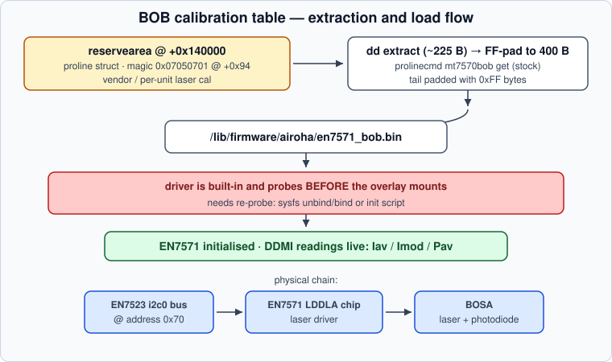

# 💡 The LDDLA / BOSA Optical Front-end

[← Back to README](../README.md) · [WiFi calibration →](wifi-calibration.md)

The GPON optical transceiver is not a pluggable SFP — it is a **BOSA**
(Bidirectional Optical Sub-Assembly) bonded to the main PCB and driven by a
dedicated **EN7571** chip hanging off **i2c0 at address 0x70**.



## Identification evidence

* Vendor kernel symbols: `en7571_*`, threads `LDDLA_task_wait`,
  `i2c_access_queu`
* `led.conf`: gpio16 = laser **tx-disable**
* Live i2c scan: exactly one device at `0x70`
* After BOB load: `EN7571 initialised: GPON, rev 2, KT1, DDMI1`

## The BOB calibration table

The EN7571 needs a small factory calibration table ("BOB") describing the
laser's per-unit characteristics. In the vendor world this is a ~225-byte
blob (100 words of register values):

| Offset | Field |
|---|---|
| 0x000 | `IAV_IMOD` — [27:16] Iav, [11:0] Imod (laser currents) |
| 0x004 | `PAV_P1` — [27:16] APC/Pav, [9:0] ERC/P1 |
| 0x008 | open-loop seed — Ibias/Imod |
| 0x00C | T0C/T1C temperature compensation delays |
| 0x010 | APD slopes up/down (V/°C ×100) |
| 0x018 | APD change point @25 °C |
| ... | 100 words total (`EN7571_FLASH_WORDS`) |
| **0x094** | **PON magic** — bits[31:24] profile, [7:0] chip-id, [23:8] must equal `0x00050700` |

## Where it hides on the PX3321-T1

Not in the firmware image, not in romfile, not in rom-d, not in wwan.
It lives in the **reservearea partition**, inside the proline factory
structure:

```text
reservearea + 0x140000   ←  BOB table region (BOB_RA_OFFSET)
                            first words: Iav/Imod/Pav calibration
                            +0x94: PON magic, e.g. 0x07050701
```

Harvest method on stock:

```sh
/usr/bin/prolinecmd mt7570bob get
# prints the hexdump of the table read from reservearea
```

## Enabling DDMI on mainline

The mainline Airoha optical driver loads the table via the standard
firmware/nvmem paths:

```text
/lib/firmware/airoha/en7571_bob.bin   ← 400 bytes (pad the tail with FF)
```

Once present:

```text
en7571 0-0070: loaded 400-byte little-endian BOB ...
en7571 0-0070: EN7571 initialised: GPON, rev 2, KT1, DDMI1
/sys/bus/i2c/devices/0-0070/optical_frontend/frontend0/
    model = EN7571-LDDLA    ready = 1    tx_enabled = 0
    hwmon/ → laser bias current sensor
```

> [!WARNING] Per-unit data
> The BOB contains **this unit's** laser bias and power settings
> (Iav/Imod/Pav). Copying another unit's blob may mis-bias your laser.
> Extract your own from reservearea; publish the *format*, not blobs.

## Gotchas

* The driver is built-in and probes **before the overlay mounts** — the
  firmware file must be re-probed after boot (unbind/bind via sysfs) or an
  init script must delay/retrigger the probe.
* `zycli i2c read` cannot access the chip while the kernel driver owns the
  bus (`ERROR: open(-1)` + *"BOSA already registered I2C device"*).

---

[← Back to README](../README.md) · [WiFi calibration →](wifi-calibration.md)
