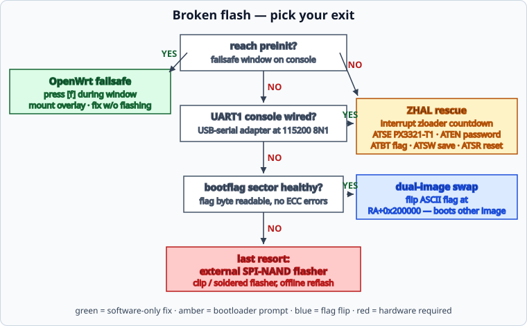

# 🚑 Recovery Toolbox

[← Back to README](../README.md) · [Bootloop forensics →](bootloop-forensics.md)

Three independent ways back from a broken flash — learn all three before
writing anything to NAND.



## 1. OpenWrt failsafe mode

If the installed system reaches **preinit** (even if it panics later),
press `f` + Enter during the failsafe window:

```text
Press the [f] key and hit [enter] to enter failsafe mode
...
- failsafe -
BusyBox v1.38.0 ...
================= FAILSAFE MODE active ================
```

Then:

```sh
mount_root                # mounts the jffs2 overlay
# fix files under /overlay/upper/...
sync
reboot -f
```

Use cases observed on this board: removing a broken module override,
fixing network config, disabling a service that blocks boot.
Note: overlayfs **does not honour whiteout char devices** created manually,
and kernel-side firmware autoload bypasses `/etc/modules.d` shadowing —
some fixes need a real reflash instead.

## 2. ZHAL (vendor bootloader prompt)

The zloader drops to `ZHAL>` if interrupted during its short countdown
window. Repeated Enter through several boot cycles usually catches it.

### The ATSE / ATENv3 password calculation

Privileged ZHAL commands require a password derived from a per-device seed:

```text
ZHAL> ATSE PX3321-T1
<seed: 36 hexadecimal characters>
```

The **ATENv3** algorithm (documented by the GPON community):

1. Hex-decode the seed → raw bytes.
2. Compute `MD5(raw_bytes)` → 32-char lowercase hex digest.
3. Process the digest in nibble pairs `(hi, lo)` at even positions:
   * `xor = value(hi) XOR value(lo)`
   * if `xor < 10`: output char `chr(xor + ord('0'))`
   * else: output char `chr((xor - 10) + ord('W') ... )` — in practice the
     reference implementation maps values ≥ 10 with an offset of `0x57`.
4. The resulting 8-character string is the password.

Reference implementation (Python):

```python
import hashlib

def atenv3_password(seed_hex):
    md = hashlib.md5(bytes.fromhex(seed_hex)).hexdigest()
    out = []
    for i in range(0, 16, 2):
        xor = int(md[i], 16) ^ int(md[i+1], 16)
        out.append(chr(xor + (0x30 if xor < 10 else 0x57)))
    return "".join(out)
```

### Unlock and switch images

```text
ZHAL> ATEN 1,<password>      # unlock (no echo of success — prompt repeats)
ZHAL> ATBT 1                 # REQUIRED before ATSW: select target image
ZHAL> ATSW                   # write bootflag
ZHAL> ATSR                   # reset
```

## 3. Dual-image bootflag

The reservearea holds a single ASCII flag byte at offset **+0x200000**
(`'0'` = primary/master image, `'1'` = slave/second image):

* On stock: `/usr/bin/sys bootflag read|swap|checksum`
  (`zycli reboot` to restart — plain `reboot` may silently do nothing).
* On mainline/OpenWrt without vendor tools: write the byte directly
  (requires unlocked partition access).

> [!CAUTION]
> A corrupted flag sector (ECC errors) makes tcboot ignore every swap —
> the sector must be erased/repaired first. Always verify with a fresh
> read after writing.

## 4. Mainline U-Boot recovery via TFTP / Xmodem (EN7523, 2026.07)

When the `fit` volume on `ubi` is broken (e.g. FIT with only `kernel+fdt`, no `rootfs` → `fitblk: probe failed error -2` → `Waiting for root device /dev/fit0`), the board still boots to **U-Boot** (`Hit any key to stop autoboot: 3`). Use it to TFTP-boot an `initramfs` into RAM, then `sysupgrade` the corrected FIT.

**TFTP path (preferred — 11.8 MiB/s on this board):**

```text
U-Boot> setenv serverip 192.168.1.126   # your TFTP server
U-Boot> setenv ipaddr 192.168.1.200     # free address in same /24
U-Boot> tftpboot 0x82000000 initramfs.bin   # 9.6M FIT (kernel gzip + fdt)
Bytes transferred = 10092544 (9a0000 hex)
U-Boot> bootm 0x82000000
## Loading kernel ... Verifying Hash Integrity ... OK
## Loading fdt ... OK
Starting kernel ...
# → OpenWrt initramfs at 192.168.1.200
```

```sh
# on TFTP server (tftpd-hpa /srv/tftp)
scp openwrt-airoha-en7523-zyxel_px3321-t1-initramfs-kernel.bin \
    /srv/tftp/initramfs.bin
scp openwrt-...-squashfs-sysupgrade.bin /srv/tftp/sysupgrade-new.bin

# on initramfs (root, no password on serial; dropbear needs password)
scp -O /srv/tftp/sysupgrade-new.bin root@192.168.1.200:/tmp/sysupgrade.bin
ssh root@192.168.1.200 "md5sum /tmp/sysupgrade.bin; dumpimage -l /tmp/sysupgrade.bin | grep -E 'Image|rootfs'"
ssh root@192.168.1.200 "sysupgrade -n /tmp/sysupgrade.bin"  # -n wipes overlay
# → U-Boot now loads 3 images (kernel-1 + fdt-1 + rootfs-1 loadable) from UBI
```

**Xmodem path (when TFTP is not reachable):**

```text
U-Boot> loadx 0x82000000   # U-Boot waits for XMODEM
# on host (lrzsz): sx -X initramfs.bin < /dev/ttyUSB0 > /dev/ttyUSB0
## Total 10092544 bytes received
U-Boot> bootm 0x82000000
```

> [!NOTE]
> The corrected FIT must have **3 images** (`kernel-1` gzip 4.9M + `fdt-1` 18K + `rootfs-1` 4.7M loadable). Verify with `dumpimage -l` before flashing — the broken FIT with only 2 images triggers the exact `Waiting for root device /dev/fit0` loop.

## What the console shows when it works

```text
bootflag==1 --> booting from second image
## Loading kernel from FIT Image at 81800000 ...
   Verifying Hash Integrity ... OK
Starting kernel ...
```

If the FIT hashes fail, tcboot falls back to the primary image silently —
always confirm which image booted via `uname -r`, not by timing.

---

[← Back to README](../README.md) · [Bootloop forensics →](bootloop-forensics.md)
