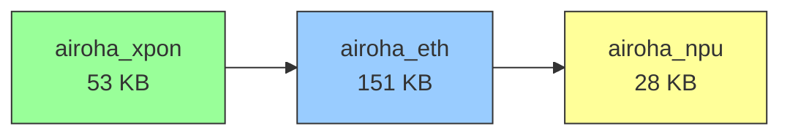

# 🔬 Session Findings — 2026-08-25

[← Back to README](../README.md)

Technical notes from OpenWrt v9 bring-up, NPU testing, and UART reverse-engineering
on the PX3321-T1.

---

## NPU Module Chain

The NPU hardware is accessed through a **three-module dependency chain**:



- **`airoha_xpon`** — xPON PHY driver (loaded first, no visible dependencies)
- **`airoha_eth`** — Ethernet/switch driver, depends on `airoha_xpon`; **refcount=1** keeps `airoha_npu` alive
- **`airoha_npu`** — proprietary NPU offload engine; firmware at `npu-binary@84000000` (1 MB), packet buffers `npu-pkt@84d00000` (22 MB); clock: 333 MHz

All three load automatically at boot via `/etc/modules.d/`. The NPU cannot be
loaded without `airoha_eth` (its sole consumer). Unloading the chain is risky —
attempting `rmmod airoha_eth` while traffic is flowing caused unrecoverable
states requiring a power cycle.

### Hardware reservations (from DT)

| Region | Address | Size | Purpose |
|---|---|---|---|
| `atf@80000000` | 0x80000000 | 256 KiB | ARM Trusted Firmware |
| `npu-binary@84000000` | 0x84000000 | 1 MiB | NPU firmware blob |
| `npu-pkt@84d00000` | 0x84d00000 | 22 MiB | NPU packet DMA buffers |
| `qdma0-buf@86400000` | 0x86400000 | 32 MiB | QDMA channel 0 |
| `qdma1-buf@88400000` | 0x88400000 | 16 MiB | QDMA channel 1 |

Total reserved: ~73 MiB of 512 MiB — leaving ~431 MiB for Linux.

---

## NPU Performance Test

Throughput measurement with the NPU active (5 iperf3 streams, 10 s):

| Metric | Value |
|---|---|
| Throughput | **854 Mbits/s** |
| Total data | 1.01 GBytes |
| CPU total | 73% |
| cpu0 (iperf3 app) | 56% |
| cpu1 (bridge TX/NPU callback) | 83% |
| TCP retransmits | ~5,500 (TCP window issue, not CPU) |
| Softnet drops | 0 |

**Key finding:** The NPU distributes forwarding load across both Cortex-A7 cores.
cpu1 handles the bridge/NPU callback path while cpu0 runs the iperf3 application.
The CPU bottleneck is in the TCP stack, not in the NPU forwarding path.

---

## Kernel Panic — NULL Pointer in LED Trigger

During boot, a kernel NULL pointer dereference occurs in the `led` process:

```text
PC is at strlen+0x0/0x2c
LR is at netdev_trig_activate+0x120/0x18c
Process led (pid: 905)
Call trace:
  strlen from netdev_trig_activate+0x120/0x18c
  netdev_trig_activate from led_trigger_set+0x1cc/0x318
  led_trigger_set from led_trigger_write+0xf8/0x140
```

The `led` userspace process writes to a sysfs LED trigger attribute, which calls
`netdev_trig_activate()` → `strlen()` on a NULL pointer. This is likely a bug in
the LED trigger subsystem when a netdev trigger is activated before the netdev
name is fully initialized. The kernel panics and reboots automatically.

**Impact:** The device reboots on first boot after flash, then boots successfully
on the second attempt (the LED trigger state is now consistent). This is a known
quirk in the LED/PHY initialization order.

---

## Boot Timing (from UART capture)

```text
T+0.0s    reboot command issued
T+~12s    EN7523DRAMC V0.6 — DRAM init (DDR3-1866, 512 MB)
T+~13s    U-Boot 2014.04-rc1 starts
T+~14s    SPI NAND probe (Micron MT29F2G01, 256 MiB)
T+~15s    BMT & BBT init
T+~16s    Network init (ecnt_eth)
T+~17s    zloader v2.5.6 loaded from 0x50000 (15.7 KiB)
T+~18s    "Hit any key to stop autoboot: 5"
T+~23s    autoboot expires → bootflag==1 → slave image
T+~24s    FIT image loaded, kernel decompressed
T+~25s    Linux kernel starts (6.18.41)
T+~28s    init: Console is alive
T+~35s    procd: init complete
```

**Total boot time: ~35 seconds** from reboot command to shell prompt.

The U-Boot autoboot window is **5 seconds** — interruptible via UART keypress.
The `printenv` command was never captured because the window is narrow and
SSH→UART latency makes reliable interception difficult without a dedicated
serial capture script running on the same host.

---

## SPI NAND Flash Layout (precise offsets)

From kernel boot log — **14 fixed partitions** on Micron MT29F2G01:

| Offset | End | Size | MTD | Name |
|---|---|---|---|---|
| 0x00000000 | 0x00008000 | 512 KB | mtd0 | u-boot |
| 0x00008000 | 0x0000C000 | 256 KB | mtd1 | romfile |
| 0x0000C000 | 0x004C0858 | ~4 MB | mtd2 | kernel |
| 0x004C0858 | 0x030C0000 | ~44 MB | mtd3 | rootfs |
| 0x0000C000 | 0x030C0000 | ~48 MB | mtd4 | tclinux |
| 0x030C0000 | 0x034C0858 | ~4 MB | mtd5 | kernel_slave ★ |
| 0x034C0858 | 0x049C0000 | ~20 MB | mtd6 | rootfs_slave ★ |
| 0x049C0000 | 0x061C0000 | ~24 MB | mtd7 | rootfs_data (JFFS2) |
| 0x030C0000 | 0x061C0000 | ~49 MB | mtd8 | tclinux_slave ★ |
| 0x061C0000 | 0x062C0000 | 1 MB | mtd9 | wwan |
| 0x062C0000 | 0x066C0000 | 4 MB | mtd10 | data |
| 0x066C0000 | 0x067C0000 | 1 MB | mtd11 | rom-d |
| 0x067C0000 | 0x0DDC0000 | ~118 MB | mtd12 | misc |
| 0x0DDC0000 | 0x0E000000 | ~2.25 MB | mtd13 | reservearea |

★ = our OpenWrt v9 image lives here (bootflag=1 selects slave partitions).

---

## U-Boot Boot Command (from kernel cmdline)

The zloader injects this as the kernel command line:

```text
sdram_conf=0x00108893
ethaddr=XX:XX:XX:XX:XX:XX
snmp_sysobjid=1.2.3.4.5
country_code=D0
ether_gpio=0c
power_gpio=1515
username=telecomadmin
password=root
dsl_gpio=0a
internet_gpio=01
multi_upgrade_gpio=0b0a03010604051b1a00000000000000
onu_type=2
qdma_init=31
root=/dev/mtdblock6
ro
console=ttyS0,115200n8
earlycon
bootflag=1
serdes_sel=0
tclinux_info=0x1cd1af7,0x2090,0x28f62f,0x2917b8,0x1a40004,0x8e0d3b,0x4b9c,0x3fba9b,0x4006e4,0x4e0112
```

**Classification:**

| Variable | Type | Purpose |
|---|---|---|
| `sdram_conf` | Board | DRAM timing config |
| `ethaddr` | Board | Factory MAC address |
| `snmp_sysobjid` | Board | SNMP object ID |
| `country_code` | Board | Regulatory domain |
| `ether_gpio`, `power_gpio`, `dsl_gpio`, `internet_gpio`, `multi_upgrade_gpio` | Board | GPIO pin assignments |
| `username`, `password` | Board | Default web credentials |
| `onu_type` | Board | ONU type identifier |
| `qdma_init` | Board | QDMA initialization params |
| `root` | Boot | Root filesystem device |
| `console` | Boot | Serial console config |
| `bootflag` | Boot | Which partition set to boot |
| `serdes_sel` | Board | SerDes lane selection |
| `tclinux_info` | Board | Firmware metadata pointers |

---

## Build Configuration

| Parameter | Value |
|---|---|
| OpenWrt version | SNAPSHOT r0+35806-c8cfe28d34 |
| Kernel | 6.18.41 (SMP, ARMv7) |
| GCC | OpenWrt GCC 14.4.0 r35932 |
| Target | airoha/en7523 |
| LuCI | luci-app-optical (native view, commit `7c7ee92dec`) |
| NPU | airoha_npu loaded, 333 MHz |
| Flowtable | nftables `flags offload` on lan1-lan4 |

---

*Captured via UART (CH340 USB-serial) and live device inspection.*
*2026-08-25 session.*
