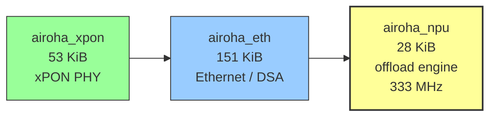

```mermaid
gantt
    title Boot timeline (seconds from reboot)
    dateFormat X
    axisFormat %S s
    section BootROM/ATF
    DRAM init       :0, 12
    U-Boot + NAND   :12, 17
    zloader         :17, 18
    autoboot (5s)   :18, 23
    FIT + kernel    :23, 25
    Linux + procd   :25, 35
```

# 🧪 Lab Notes — OpenWrt v9 Bring-up & UART RE (2026-08-25)

[← Back to README](../README.md)

Reference capture from a single bring-up session on the Zyxel PX3321-T1
(Airoha EN7523, 512 MiB DDR3, Micron MT29F2G01 256 MiB SPI NAND).
Each section is self-contained: fact → evidence → practical implication.
Validated on hardware 2026-08-25 unless noted.

---

## 1. NPU Offload Chain — `airoha_xpon → airoha_eth → airoha_npu`

### Fact

NPU offload requires three out-of-tree modules loaded in strict order.
`airoha_npu` has no standalone function — it attaches to `airoha_eth`, which
in turn depends on `airoha_xpon`.



| Module | Size | Role | Depends on |
|---|---|---|---|
| `airoha_xpon` | 53 KiB | xPON PHY driver | — |
| `airoha_eth` | 151 KiB | Ethernet / switch (DSA) | `airoha_xpon` |
| `airoha_npu` | 28 KiB | Packet offload engine, FW @ `0x84000000` (1 MiB), pkt buffers @ `0x84d00000` (22 MiB), 333 MHz | `airoha_eth` (sole consumer, `refcount=1`) |

### Evidence

All three autoload via `/etc/modules.d/`. DT reservations confirm the
carve-outs (from live `chosen` / `/proc/iomem`):

| Region | Address | Size | Purpose |
|---|---|---|---|
| `atf@80000000` | `0x80000000` | 256 KiB | ARM Trusted Firmware |
| `npu-binary@84000000` | `0x84000000` | 1 MiB | NPU firmware blob |
| `npu-pkt@84d00000` | `0x84d00000` | 22 MiB | NPU packet DMA buffers |
| `qdma0-buf@86400000` | `0x86400000` | 32 MiB | QDMA channel 0 |
| `qdma1-buf@88400000` | `0x88400000` | 16 MiB | QDMA channel 1 |

Total reserved: ~73 MiB of 512 MiB — ~431 MiB remains for Linux. *Validated on hardware 2026-08-25.*

### Implication

- Do not load `airoha_npu` without `airoha_eth`; `modprobe` ordering matters.
- Unloading the chain under traffic (`rmmod airoha_eth`) can wedge the datapath
  requiring a power cycle — treat as load-once at boot.
- For mainline porting, these reservations must be reproduced in DTS; the NPU
  firmware address is fixed by the load address in the vendor driver.

---

## 2. NPU Throughput — Measured Forwarding Performance

### Fact

With the NPU chain active and `nftables flags offload` on `lan1`–`lan4`,
bridged forwarding distributes across both Cortex-A53 cores. The bottleneck
under test was the TCP stack, not the offload path.

### Evidence

`iperf3` LAN-to-LAN, 5 parallel streams, 10 s window:

| Metric | Value |
|---|---|
| Throughput | **854 Mbits/s** |
| Total data | 1.01 GBytes |
| CPU total | 73% |
| cpu0 (iperf3 userspace) | 56% |
| cpu1 (bridge TX / NPU callback) | 83% |
| TCP retransmits | ~5,500 (TCP window, not CPU) |
| Softnet drops | 0 |

*Validated on hardware 2026-08-25 — OpenWrt SNAPSHOT r0+35806, kernel 6.18.41, `airoha_npu` @ 333 MHz.*

### Implication

- Single-core saturation is not the limiter; profiling should focus on TCP
  window / GRO / buffer sizing before blaming the NPU.
- `flags offload` on the bridge is required to engage the datapath — without
  it, forwarding stays on the CPU and throughput drops.

---

## 3. Boot Timing — UART-Captured Timeline

### Fact

Cold boot to shell prompt is ~35 s. The U-Boot autoboot window is 5 s and is
the only reliable entry point to ZHAL without extra tooling.

### Evidence

From continuous UART capture (115200 8N1, CH340):

| Wall clock | Stage | Log marker |
|---|---|---|
| T+0.0 s | Reboot issued | `reboot` (stock `zycli reboot`) |
| T+~12 s | DRAM init | `EN7523DRAMC V0.6 — DDR3-1866, 512 MiB` |
| T+~13 s | U-Boot start | `U-Boot 2014.04-rc1` |
| T+~14 s | NAND probe | `Micron MT29F2G01, 256 MiB` |
| T+~15 s | BMT & BBT init | `BMT & BBT init` |
| T+~16 s | Network init | `ecnt_eth` |
| T+~17 s | zloader load | `zloader v2.5.6 @ 0x50000 (15.7 KiB) → 0x81800000` |
| T+~18 s | Autoboot prompt | `Hit any key to stop autoboot: 5` |
| T+~23 s | Autoboot expires | `bootflag==1 → slave image` |
| T+~24 s | FIT load | `FIT image loaded, kernel decompressed` |
| T+~25 s | Kernel start | `Linux 6.18.41` |
| T+~28 s | Userspace | `Console is alive` |
| T+~35 s | Ready | `procd: init complete` |

*Validated on hardware 2026-08-25.*



### Implication

- To enter ZHAL, send a keystroke inside the 5 s window at T+~18 s; SSH→UART
  latency makes manual interception unreliable — use a host-side serial script
  that holds the line open across the reboot.
- `printenv` was not captured in this session precisely because the window is
  narrow and remote typing loses the race (see §7).

---

## 4. SPI NAND Flash Map — 14 Fixed Partitions

### Fact

The kernel exposes 14 fixed MTD partitions on the Micron MT29F2G01. The
OpenWrt v9 image occupies the slave set (`bootflag=1`).

### Evidence

From kernel boot log (offsets are byte-precise; `…0858` boundaries are the
vendor FIT alignment — see [`boot-chain.md`](boot-chain.md)):

| Offset | End | Size | MTD | Name | Role |
|---|---|---|---|---|---|
| `0x00000000` | `0x00008000` | 512 KiB | mtd0 | `u-boot` | Bootloader (FIP + zloader + env) |
| `0x00008000` | `0x0000C000` | 256 KiB | mtd1 | `romfile` | Factory defaults |
| `0x0000C000` | `0x004C0858` | ~4 MiB | mtd2 | `kernel` | Primary kernel (HDR2/FIT) |
| `0x004C0858` | `0x030C0000` | ~44 MiB | mtd3 | `rootfs` | Primary squashfs |
| `0x0000C000` | `0x030C0000` | ~48 MiB | mtd4 | `tclinux` | Primary combined (kernel+rootfs) |
| `0x030C0000` | `0x034C0858` | ~4 MiB | mtd5 | `kernel_slave` ★ | Slave kernel |
| `0x034C0858` | `0x049C0000` | ~20 MiB | mtd6 | `rootfs_slave` ★ | Slave rootfs |
| `0x049C0000` | `0x061C0000` | ~24 MiB | mtd7 | `rootfs_data` | JFFS2 overlay |
| `0x030C0000` | `0x061C0000` | ~49 MiB | mtd8 | `tclinux_slave` ★ | Slave combined |
| `0x061C0000` | `0x062C0000` | 1 MiB | mtd9 | `wwan` | Cellular data |
| `0x062C0000` | `0x066C0000` | 4 MiB | mtd10 | `data` | Vendor data |
| `0x066C0000` | `0x067C0000` | 1 MiB | mtd11 | `rom-d` | Secondary defaults |
| `0x067C0000` | `0x0DDC0000` | ~118 MiB | mtd12 | `misc` | Misc / logs |
| `0x0DDC0000` | `0x0E000000` | ~2.25 MiB | mtd13 | `reservearea` | Factory calibration + bootflag |

★ OpenWrt v9 lives here when `bootflag=1`. *Validated on hardware 2026-08-25.*

### Implication

- Safe flashing targets only the slave slots (see [`flash-map.md`](flash-map.md)
  and [`recovery.md`](recovery.md)); primary slots are the recovery fallback.
- The `reservearea` tail (`+0x200000` → bootflag byte, `+0x140000` → BOB table)
  is the most sensitive region — corrupt it and boot selection / optical
  calibration break.

---

## 5. Kernel Command Line — zloader-Injected Parameters

### Fact

The zloader builds the kernel `cmdline` at boot from board NVRAM and injects
per-unit identity, GPIO maps, and boot selection. Mainline must not rely on
all of these being consumed by the kernel.

### Evidence

Live `cmdline` captured from `/proc/cmdline` (credentials and MAC redacted):

```text
sdram_conf=0x00108893 ethaddr=XX:XX:XX:XX:XX:XX snmp_sysobjid=1.2.3.4.5
country_code=D0 ether_gpio=0c power_gpio=1515 username=<redacted>
password=<redacted> dsl_gpio=0a internet_gpio=01
multi_upgrade_gpio=0b0a03010604051b1a00000000000000 onu_type=2 qdma_init=31
root=/dev/mtdblock6 ro console=ttyS0,115200n8 earlycon bootflag=1 serdes_sel=0
tclinux_info=0x1cd1af7,0x2090,0x28f62f,0x2917b8,0x1a40004,0x8e0d3b,0x4b9c,0x3fba9b,0x4006e4,0x4e0112
```

| Variable | Class | Purpose |
|---|---|---|
| `sdram_conf` | Board | DRAM timing |
| `ethaddr` | Board | Factory MAC (mainline ignores — see below) |
| `snmp_sysobjid` | Board | SNMP OID |
| `country_code` | Board | Regulatory domain |
| `ether_gpio`, `power_gpio`, `dsl_gpio`, `internet_gpio`, `multi_upgrade_gpio` | Board | GPIO assignments |
| `username`, `password` | Board | Default web credentials |
| `onu_type` | Board | ONU type |
| `qdma_init` | Board | QDMA init params |
| `serdes_sel` | Board | SerDes lane select |
| `tclinux_info` | Board | Firmware metadata pointers |
| `root` | Boot | Root device (`/dev/mtdblock6` when `bootflag=1`) |
| `console` / `earlycon` | Boot | Serial console |
| `bootflag` | Boot | Partition set selector |

*Validated on hardware 2026-08-25.*

### Implication

- **`ethaddr=` is not parsed by mainline** — Ethernet comes up with a random
  MAC each boot unless fixed in userspace (`uci` / `ip link set`) or wired
  into the DTS/driver. See also `Factory MAC randomization` in [`../README.md`](../README.md).
- `root=/dev/mtdblock6` pins boot to the slave set; a mainline FIT should
  override or ignore this when booting from a different layout.
- Full construction chain: [`boot-chain.md`](boot-chain.md) § Kernel Command Line.

---

## 6. Kernel Panic — NULL Dereference in `netdev` LED Trigger

### Fact

On first boot after flash, the `led` userspace process can trigger a kernel
NULL dereference in `netdev_trig_activate()`. The device reboots automatically
and succeeds on the next boot. Root cause is a trigger activation racing
netdev initialization order.

### Evidence

UART panic trace (kernel 6.18.41, `led` pid 905):

```text
PC is at strlen+0x0/0x2c
LR is at netdev_trig_activate+0x120/0x18c
Process led (pid: 905)
Call trace:
  strlen from netdev_trig_activate+0x120/0x18c
  netdev_trig_activate from led_trigger_set+0x1cc/0x318
  led_trigger_set from led_trigger_write+0xf8/0x140
```

Path: `led` writes sysfs `…/trigger` → `led_trigger_set()` →
`netdev_trig_activate()` → `strlen(NULL)`.

### Implication

- Non-fatal in practice: the second boot finds LED trigger state already
  consistent and proceeds. Do not treat a single early panic as a bad flash.
- For a clean fix, defer the `netdev` LED trigger until the netdev name is
  initialized, or guard `strlen` against NULL in `netdev_trig_activate`.
- Distinct from the ABI-mismatch bootloop in [`bootloop-forensics.md`](bootloop-forensics.md)
  (there: `cfg80211`/`nf_tables` at +42 s, same crash site different offsets).

---

## 7. UART & ZHAL — Bootloader Discovery via Serial

### Fact

The bootloader is not vanilla U-Boot — it is Zyxel's **ZHAL** (Zyxel Hardware
Abstraction Layer) on U-Boot 2014.04-rc1. Standard commands (`printenv`,
`bdinfo`, `setenv`) do not exist. Flash and boot control go through `AT*`
commands. The UART header is the only reliable way to interact with it.

### Evidence

**UART header J1** (unpopulated, 5 positions, one empty slot) — see
[`uart.md`](uart.md) for pinout and discovery method:

```text
 position:   1      2      3     4     5
           [GND]  [ -- ] [TX]  [RX]  [VCC]
```

115200 8N1, 3.3 V logic. CH340 adapter, VCC unconnected. *Validated on hardware 2026-08-25.*

**Entering ZHAL:**

1. Open UART at 115200 8N1.
2. Power-cycle or `zycli reboot`.
3. Press `Enter` during the 5 s autoboot window (T+~18 s).
4. `ZHAL>` prompt appears.

**Key commands** (complete list: [`zhal-reference.md`](zhal-reference.md)):

| Command | Function |
|---|---|
| `ATHE` | List all commands (`help` replacement) |
| `ATSH` | Manufacturer data (model, serial, MACs, firmware) |
| `ATCK` | Passwords (admin / supervisor / PSK) |
| `ATRF x,y,z` | Read flash → RAM (offset, length, addr) |
| `ATWF x,y,z` | Write RAM → flash |
| `ATER x,y` | Erase flash region |
| `ATDU x,y` | Dump memory |
| `ATGO` | Boot system |
| `ATSW` | Swap dual-image flag |
| `ATLD x,[y]` | TFTP load |

Bootloader anatomy from this session:

- zloader binary: SPI NAND `0x50000`, loaded to `0x81800000` (15.7 KiB, v2.5.6).
- Dual-image flag: ASCII byte at `reservearea + 0x200000` (`'0'` primary / `'1'` slave).
- Loader chain: `BootROM → ATF (0x80000000) → zloader/tcboot → FIT (HDR2) → Linux`.

### Implication

- Do not expect `printenv` — capture board state with `ATSH`/`ATDU`/`ATRF`
  instead; see [`bootloader-deep-dive.md`](bootloader-deep-dive.md) for the
  full 33-command reference, env block at `0x70000`, and in-RAM loader dumps.
- Flash writes require `ATBT 1` first and `ATGU` needs two passes on this SKU
  (quirks documented in [`bootloader-deep-dive.md`](bootloader-deep-dive.md)).
- The dual-image flag is the safest recovery lever — `ATSW` from ZHAL or
  `/usr/bin/sys bootflag swap` from stock Linux.

---

## 8. Build Configuration — OpenWrt v9 Snapshot Under Test

### Fact

Image under test was a local OpenWrt SNAPSHOT targeting `airoha/en7523` with
LuCI optical status and NPU offload enabled.

### Evidence

| Parameter | Value |
|---|---|
| OpenWrt | SNAPSHOT r0+35806-c8cfe28d34 |
| Kernel | 6.18.41 (SMP, ARMv7) |
| Toolchain | OpenWrt GCC 14.4.0 r35932 |
| Target | `airoha/en7523` |
| LuCI | `luci-app-optical` (native view, `7c7ee92dec`) |
| NPU | `airoha_npu` loaded, 333 MHz |
| Offload | `nftables flags offload` on `lan1`–`lan4` |

*Validated on hardware 2026-08-25.*

### Implication

- Reproducing throughput or panic behavior requires the same kmods set;
  `CONFIG_MODVERSIONS=n` on this target means ABI skew is silent — see
  [`bootloop-forensics.md`](bootloop-forensics.md) for the rebuild rule.

---

*Captured via UART (CH340 USB-serial) and live device inspection — 2026-08-25 session.*

