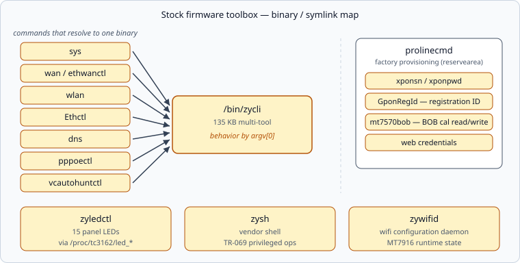

# 🧰 Vendor Toolbox

[← Back to README](../README.md) · [Optical BOB →](optical-bob.md)

The stock firmware ships a set of small binaries that are far more useful
than their names suggest. All live in `/bin` or `/usr/bin`.



## zycli — the multi-tool

`/bin/zycli` is a single 135 KB binary; many familiar commands are symlinks
to it and change behavior by argv[0]:

```text
sys             → bootflag read/swap/checksum, misc flash ops
wan / ethwanctl → WAN interface control
wlan            → wireless control
Ethctl          → ethernet diagnostics
dns             → DNS helpers
pppoectl        → PPPoE sessions
vcautohuntctl   → virtual circuit auto-hunt (DSL heritage)
restoredefault  → factory reset
swversion       → firmware version display
```

Examples:

```sh
sys bootflag read        # current dual-image flag
zycli reboot             # native restart (plain reboot may silently no-op)
zycli swversion show     # firmware version
```

It also embeds an **i2c bus reader** (`zycli i2c read <hex> <hex> <int>`),
but it fails with `open(-1)` while the LDDLA/BOSA kernel driver owns the
bus — see [optical-bob.md](optical-bob.md).

## zyledctl — LED control

```text
usage: ledctl [LED_NAME] [LED_ACTION]
LED_NAME: POWER_G POWER_R INET_G INET_R ADSL0 VDSL0 xPON_G xPON_R
          Wlan0 WPS0 Wlan1 WPS1 USB0_G USB1_G DECT
LED_ACTION: on | off | slow | fast
```

Thin wrapper over the 16 knobs in `/proc/tc3162/led_*`. The LED names map
one-to-one to the physical panel (note: PON and LOS are separate lamps,
as are the WiFi amber/blue pairs).

## prolinecmd — factory provisioning

Reads/writes the per-unit provisioning block inside the reservearea
(the `proline_Para` structure). Subcommands:

```text
serialnum  manufacturerOUI  productclass  hwver      # GPON identity
xponsn     xponpwd          xponmode                 # XPON credentials
GponRegId  romfileselect                             # registration ID
mt7570bob  get                                       # laser BOB table ← see optical-bob.md
webpwd     webAccount                                # web credentials
ssid       ssid2nd         wpakey ...                # wireless defaults
clear      restore         version                   # maintenance
```

Most fields only expose `set` in usage text, but the underlying data is
readable from the reservearea region directly (`BOB_RA_OFFSET`,
`PROLINE_CWMPPARA_RA_OFFSET` — see the GPL header
`global_inc/uapi/flash_layout/prolinecmd.h`).

## Others worth knowing

| Tool | Purpose |
|---|---|
| `zysh` | vendor shell used by TR-069 to run privileged operations |
| `zywifid` | wifi configuration daemon (MT7916 runtime state) |
| `zycfgfilter` | config conversion layer |
| `zyMAPSteer` | band steering / EasyMesh |
| `/usr/script/lib_xpon` | shell library: `xpon_get_7570bob()` calls prolinecmd |

---

[← Back to README](../README.md) · [Optical BOB →](optical-bob.md)
